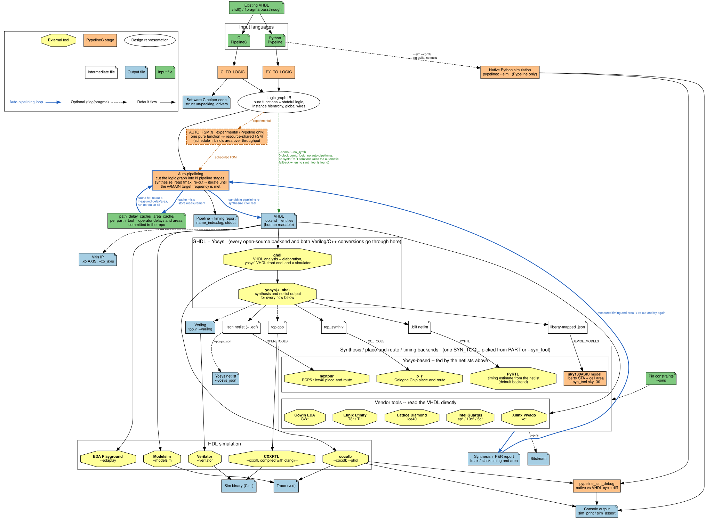

```
██████╗ ██╗   ██╗██████╗ ███████╗██╗     ██╗███╗   ██╗███████╗ ██████╗
██╔══██╗╚██╗ ██╔╝██╔══██╗██╔════╝██║     ██║████╗  ██║██╔════╝██╔════╝
██████╔╝ ╚████╔╝ ██████╔╝█████╗  ██║     ██║██╔██╗ ██║█████╗  ██║     
██╔═══╝   ╚██╔╝  ██╔═══╝ ██╔══╝  ██║     ██║██║╚██╗██║██╔══╝  ██║     
██║        ██║   ██║     ███████╗███████╗██║██║ ╚████║███████╗╚██████╗
╚═╝        ╚═╝   ╚═╝     ╚══════╝╚══════╝╚═╝╚═╝  ╚═══╝╚══════╝ ╚═════╝
```


# What is PypelineC?

A hardware description language (HDL) adding high level synthesis(HLS)-like automatic pipelining as a language construct/compiler feature. 

If a computation can be written as a [pure function](https://en.wikipedia.org/wiki/Combinational_logic) without side effects (i.e. no registers/static variables) then it can be auto-pipelined. Conceptually similar to technologies like [Intel's variable latency Hyper-Pipelining](https://www.intel.com/content/www/us/en/programmable/documentation/jbr1444752564689.html#esc1445881961208) and [Xilinx's retiming options](https://www.xilinx.com/support/answers/65410.html). Sharing some of the compiler driven pipelining design goals of [Google's XLS Project](https://google.github.io/xls/), the [DFiantHDL language](https://dfianthdl.github.io/), and certain [CIRCT](https://circt.llvm.org/) dialects as well.

PypelineC consists of [**Pypeline**](docs/README.md) (new, Python based) and [**PipelineC**](https://github.com/JulianKemmerer/PipelineC/wiki) (legacy, C based). Pypeline is a work in progress in becoming feature complete with PipelineC, but already has many new features that PipelineC lacks.

**Example code for blinking an LED:**

<table>
<tr>
<th>Pypeline (<a href="examples/pypeline/blink.py">examples/pypeline/blink.py</a>)</th>
<th>PipelineC (<a href="examples/blink.c">examples/blink.c</a>)</th>
</tr>
<tr>
<td valign="top">

```python
# 'Called'/'Executing' every 40ns (25MHz)
@MAIN(25.0)
def blink() -> uint1_t:
    # 25000000 iterations * 40ns each = 1 sec
    counter: Reg[uint32_t] = 0

    # LED on/off state
    led: Reg[uint1_t] = 0

    # If reached 1 second
    if counter == (25000000 - 1):
        led = ~led  # Toggle led
        counter = 0  # Reset counter
    else:
        counter += 1 # one 40ns increment

    return led
```

</td>
<td valign="top">

```c
// 'Called'/'Executing' every 40ns (25MHz)
#pragma MAIN_MHZ blink 25.0
uint1_t blink()
{
  // 25000000 iterations * 40ns each = 1sec
  static uint25_t counter = 0;

  // LED on off state
  static uint1_t led = 0;

  // If reached 1 second
  if(counter==(25000000-1))
  {
    // Toggle led
    led = !led;
    // Reset counter
    counter = 0;
  }
  else
  {
    counter += 1; // one 40ns increment
  }
  return led;
}
```

</td>
</tr>
</table>

| | Pypeline | PipelineC |
|---|---|---|
| **Getting started** | [/docs directory](docs/README.md) | [GitHub wiki](https://github.com/JulianKemmerer/PipelineC/wiki) |
| Easy to understand software-like syntax | [Yes](docs/pypeline_guide.md#what-is-pypeline) | Yes |
| Timing feedback from synthesis+pnr tools | [Yes](docs/pypeline_guide.md#top-level-entry-points) | Yes |
| Automatic pipelining of comb. logic | [Yes](docs/pypeline_guide.md#automatic-hls-like-implementation) | Yes |
| Dev board specific support packages | [Yes](docs/pypeline_guide.md#worked-example-vga-test-pattern) | Yes |
| VHDL Output | Yes (human readable) | Yes (human readable) |
| VHDL based existing module import | [Yes](docs/pypeline_guide.md#raw-vhdl-passthrough-vhdl) | Yes |
| Verilog Output | Yes (machine converted) | Yes (machine converted) |
| Verilog based existing module import | No | No |
| Traditional HDL simulator support | [Yes](docs/pypeline_guide.md#simulation) | Yes |
| Native Simulation | [Yes](docs/pypeline_guide.md#simulation) | No |
| Valid-Ready handshaking | [Yes](docs/pypeline_guide.md#the-stream-interface-validready-handshaking) | Yes |
| Globally visible point to point wires | [Yes](docs/pypeline_guide.md#global-signals) | Yes |
| Multiple clock domains / Clock domain crossings | No | Yes |
| Parameterized/Template Functions+Types | [Yes](docs/pypeline_guide.md#parametric-hardware-with-factory-functions) | No |
| Operator overloading | [Yes](docs/pypeline_guide.md#custom-operators) | Yes (hacky) |
| User-visible automatic pipeline latency | [Yes](docs/pypeline_guide.md#latency-reading-back-the-discovered-pipeline-depth) | No |
| Multi-cycle path constraints | [Yes](docs/pypeline_guide.md#multi-cycle-paths-multi_cycle) | Yes |
| Automatic multi-cycle path tuning (New) | [Yes](docs/pypeline_guide.md#auto_multi_cycle) | No |
| Combinational area / delay optimization (New, experimental) | [Yes](docs/pypeline_guide.md#auto_comb_area_opt--auto_comb_delay_opt-experimental) | No |
| Automatic resource-shared state machines (New, experimental) | [Yes](docs/pypeline_guide.md#auto_fsm-experimental) | No |
| SoC system bus helpers | No | Yes |
| Generates software Helper Code | [Yes](docs/pypeline_guide.md#host-type-export-declarations) | Yes |
| Derived FSM style code | No | Yes |
| Documentation | Comprehensive, planned | Ad-hoc, organic |
| Compiler tests | Many, Automated | Limited, Hand-run |


Tools:
```
Currently Supported Tools (Linux only):
Synthesis: 
  Xilinx Vivado, 
  Intel Quartus, 
  Lattice Diamond, 
  GHDL+Yosys+nextpnr,
  Gowin EDA, 
  Efinix Efinity,
  Cologne Chip Toolchain,
  PyRTL Models
Simulation: 
  Modelsim, 
  Verilator,
  cocotb,
  CXXRTL, 
  EDAPlayground
```



## Why Pypeline?

Pypeline describes hardware directly, but replaces much of the ceremony of traditional
RTL with compact Python syntax and reusable abstractions:

* **RTL semantics without event-driven boilerplate.** A typed function is a hardware
  module, ordinary locals are combinational wires, and [`Reg[T]` is explicit
  state](docs/pypeline_guide.md#registers-regt). There are no sensitivity lists or
  separate combinational and clocked process templates to maintain; the
  [execution model](docs/pypeline_guide.md#python-vs-hardware-execution) states exactly
  what becomes wiring, a MUX, a register, or a module instance.
* **Reusable, parameterized hardware.** Ordinary compile-time Python can create
  specialized [functions and types with factory
  functions](docs/pypeline_guide.md#parametric-hardware-with-factory-functions), including
  width- and type-parameterized structs, arrays, streams, FIFOs, and arithmetic blocks.
* **Interfaces with direction and structure.** [`@interface` bundles bidirectional
  ports](docs/pypeline_guide.md#bidirectional-ports-interface), including forward payloads
  and reverse ready/credit signals, while interface functions can
  [generate reverse-path wiring](docs/pypeline_guide.md#interface-functions-write-feedforward-get-the-reverse-wired)
  instead of requiring every signal to be connected by hand.
* **Composition instead of port-map repetition.** Calling a hardware function
  [instantiates a module](docs/pypeline_guide.md#calling-functions); types and return
  values carry connections through a hierarchy using normal function composition.
* **A real elaboration language.** Compile-time Python supports loops, constants, type
  introspection, user-defined factories, and [custom
  operators](docs/pypeline_guide.md#custom-operators), enabling libraries to express
  higher-level hardware patterns rather than repeatedly manipulating individual wires.
* **Automation with conventional HDL output.** Pure functions can use
  [automatic pipelining and other implementation
  strategies](docs/pypeline_guide.md#automatic-hls-like-implementation), with synthesis
  timing feedback guiding the result. Higher-level parameterization is elaborated before
  Pypeline emits human-readable VHDL, rather than depending on every downstream tool to
  implement equivalent HDL language features. A [raw VHDL escape
  hatch](docs/pypeline_guide.md#raw-vhdl-passthrough-vhdl) for existing IP or
  vendor-specific primitives keeps the generated design in established FPGA and
  simulation flows.

Fundamental design elements are state machines/stateful elements(registers, rams, etc), auto-pipelined stateless pure functions, and interconnects (wires,cdc,async fifos,etc).

By isolating complex logic into auto-pipelineable functions, and only writing literal clock by clock hardware description when absolutely necessary, PypelineC designs do not need to be rewritten for each new target device / operating frequency.
The hope is to build shared, high performance, device agnostic, hardware designs described in a familiar and powerfully composable software-like look.

For software folks writing PypelineC should feel like solving a programming puzzle - the rules of the puzzle hide/imply hardware concepts. For hardware folks PypelineC is a better hardware description language trying to find middle ground between traditional RTL and HLS. It is my language of choice as an FPGA engineer :).
