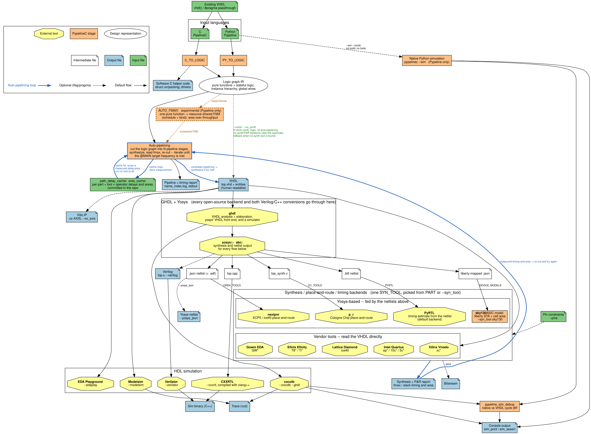
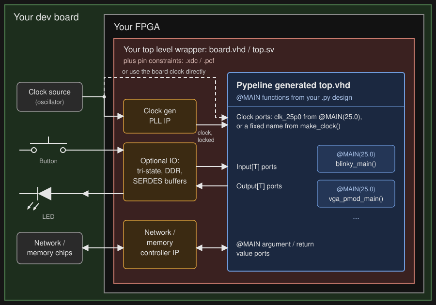
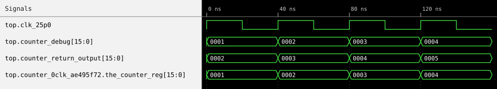

# Pypeline HDL

[Pypeline](pypeline_guide.md) is the Python front end for [PypelineC](../README.md).

We are happy to help, reach out: [PipelineC Discord](https://discord.gg/Aupm3DDrK2), [Mastodon](http://fosstodon.org/@pypelinec), [BlueSky](https://bsky.app/profile/pypelinec.bsky.social), [Discussions](https://github.com/JulianKemmerer/PipelineC/discussions) :)

## Table of Contents

1. [Quick Start](#quick-start): Install, Simulate, Generate VHDL
2. [Overview](#overview): Semantics, Ports and Clocks, Automatic Implementations
3. [What the Tool Does](#what-the-tool-does): Elaboration, Timing Feedback, HLS-like Adjustments, Reports
4. [Getting Started on a Dev Board](#getting-started-on-a-dev-board): Board Files, Clocks, Wrapper HDL, Example Projects
5. [Tools & CLI](#tools--cli): Commands, Simulation, Synthesis Backends, Output Files
6. [Set up your tools](#set-up-your-tools): Synthesis and Simulation Tool Installs

## Quick Start

On Linux, clone the repo and put `pypelinec` on your `PATH`:

```
git clone https://github.com/JulianKemmerer/PipelineC.git
cd PipelineC/
export PATH=$PATH:$(pwd)/src
```

Now you can run native Python-based simulation and generate VHDL.
EDA tools for timing feedback and bitstreams are installed separately, see
[Set up your tools](#set-up-your-tools) (or use the [Nix](#nix) package for one possible open source flow).

Try the [blinking an LED](../examples/pypeline/blink.py) demo. It should work right away with no toolchain setup at all:

```
pypelinec examples/pypeline/blink.py --sim --comb --run 3
```

Example console output:

```
Clock:  0
counter=0 led=0

Clock:  1
counter=1 led=0

Clock:  2
counter=2 led=0
```

That's `blink.py`:

```python
from pypeline import *

# 'Called'/'Executing' every 40ns (25MHz)
@MAIN(25.0)
def blink() -> uint1_t:
    # Count to 25000000 iterations * 40ns each = 1 sec
    counter: Reg[uint32_t] = 0

    # LED on/off state
    led: Reg[uint1_t] = 0

    sim_print(f"counter={counter} led={led}")

    # If reached 1 second
    if counter == (25000000 - 1):
        led = ~led  # Toggle led
        counter = 0  # Reset counter
    else:
        counter = counter + 1  # one 40ns increment

    return led
```

Generate the design's real VHDL without running any synthesis tool:

```
pypelinec examples/pypeline/blink.py --comb --no_synth
```

Example console output: (final product is VHDL/Verilog files)

```
Output directory: ./pipelinec_output_blink.py_304105
...
...
...
Output VHDL files: ./pipelinec_output_blink.py_304105/vhdl_files.txt
```

The generated top-level VHDL entity (`top.vhd`) has one input clock (named from the
`@MAIN(25.0)` frequency) and one output port (from `blink`'s `-> uint1_t` return value):

```vhdl
entity top is
port(
  -- All clocks
  clk_25p0 : in std_logic;

  -- IO for each main func
  blink_return_output : out unsigned(0 downto 0)
);
end top;
```

### Next Steps

* [Overview](#overview): how Pypeline HDL translates to hardware.
* The [Pypeline language guide](pypeline_guide.md) walks through a full worked example
  ([VGA test pattern](../examples/pypeline/vga_test_pattern.py)) and then covers every
  language feature in its own section.
* [What the Tool Does](#what-the-tool-does): from Python source to VHDL, timing reports,
  and automatic HLS-like functionality.
* [Getting Started on a Dev Board](#getting-started-on-a-dev-board): from your board's
  own blinking LED example to Pypeline running on hardware.
* [Tools & CLI](#tools--cli) and [Set up your tools](#set-up-your-tools): commands,
  simulators, synthesis backends, and installing them.
* The [examples/pypeline](../examples/pypeline) directory has more example code.
* Coming from the C front end? See [`docs/pipelinec_to_pypeline.md`](pipelinec_to_pypeline.md)
  for a pattern-by-pattern translation reference.

## Overview

Consider the following generic register + combinatorial logic, compared across Pypeline,
VHDL, and Verilog:

<table>
<tr>
<th>Pypeline</th>
<th>VHDL</th>
<th>Verilog</th>
</tr>
<tr>
<td valign="top">

```python
# Combinatorial logic with a storage register
def some_func_name(input: some_type_t) -> some_type_t:
    the_reg: Reg[some_type_t]

    # ... Do work with 'input', 'the_reg'
    # ... and other variables, functions, etc ...
    the_reg = work(the_reg, input)

    return the_reg
```

</td>
<td valign="top">

```vhdl
-- Combinatorial logic with a storage register
signal the_reg : some_type_t;
signal the_wire : some_type_t;
process(input_wire, the_reg) is -- inputs sync to clk
  variable input_variable: some_type_t;
  variable the_reg_variable : some_type_t;
begin
  input_variable := input_wire;
  the_reg_variable := the_reg;

  -- ... Do work with 'input_variable', 'the_reg_variable'
  -- and other variables, functions, etc and it kinda looks like C ...
  the_reg_variable := work(input_variable, the_reg_variable);

  the_wire <= the_reg_variable;
end process;
the_reg <= the_wire when rising_edge(clk);
output_wire <= the_wire;
```

</td>
<td valign="top">

```sv
// Combinatorial logic with a storage register
some_type_t the_reg;
some_type_t the_wire;
always@(input_wire, the_reg) begin // inputs sync to clk
  some_type_t input_variable;
  some_type_t the_reg_variable;

  input_variable = input_wire;
  the_reg_variable = the_reg;

  // ... Do work with 'input_variable', 'the_reg_variable'
  // and other variables, functions, etc and it kinda looks like C ...
  the_reg_variable = work(input_variable, the_reg_variable);

  the_wire <= the_reg_variable;
end
always_ff@(posedge clk) begin
  the_reg <= the_wire;
end
assign output_wire = the_wire;
```

</td>
</tr>
</table>


### Direct RTL semantics

The shorter Pypeline example above describes the same hardware without an event-driven
process model. A typed function is a hardware module: arguments are input ports, its
return value is an output port, and ordinary local variables are combinational wires.
A local annotated with [`Reg[T]`](pypeline_guide.md#registers-regt) is explicit stored
state. Pypeline assumes rising-edge operation within a single clock domain, so there are
no sensitivity lists, blocking/nonblocking assignment choices, or separate templates for
combinational and registered logic.

The [Python-versus-hardware execution
model](pypeline_guide.md#python-vs-hardware-execution) defines how each construct maps to
hardware: an `if` on a hardware value becomes a MUX, compile-time loops are unrolled,
register writes commit on a clock edge, and every call site creates a distinct module instance.
Functions marked [`@MAIN`](pypeline_guide.md#top-level-entry-points) become single-instance
top-level modules whose typed arguments and return value define FPGA ports.

### Top-level ports and clocks

The generated top-level module's ports all come from the source:

| Source | Top-level VHDL port |
|---|---|
| any `@MAIN(25.0)` | clock input `clk_25p0`, one per distinct rate |
| `pll_clk: Input[uint1_t] = make_clock(25.0)` | clock input `pll_clk`, replacing the rate-derived name |
| `my_input: Input[uint1_t]`, `my_output: Output[uint1_t]` | `my_input`, `my_output`, named exactly |
| argument `x` of `@MAIN` function `my_main` | input `my_main_x` |
| return value of `@MAIN` function `my_main` | output `my_main_return_output` |

A `uint1_t` port is a VHDL `unsigned(0 downto 0)`, and struct ports use the record types
in `c_structs_pkg`. Global [`Input[T]`/`Output[T]`](pypeline_guide.md#inputt--outputt--top-level-fpga-ports)
signals are the easiest way to give a design ports whose names match a board's pin
constraints, and [`make_clock`](pypeline_guide.md#naming-a-clock-with-make_clock) gives a
clock port a fixed name, as in the
[pico-ice example](#pico-ice-example). The board modules in
[include/pypeline/board](../include/pypeline/board) declare ports like these for supported
boards. In native simulation, drive `Input[T]` ports from
[`@sim_input`](pypeline_guide.md#sim_input--driving-simulation-inputs) functions, as
[fsm.py](../examples/pypeline/fsm.py) does.

### Hierarchy and interconnect by composition

“Invocation is instantiation”: [calling a hardware
function](pypeline_guide.md#calling-functions) creates and connects a module instance.
Functions can call functions to any depth, using typed values and structs instead of
repeating component declarations and one signal assignment per port. Multiple outputs
are grouped in [struct types](pypeline_guide.md#struct-types), while
[`Wire[T]`, `Input[T]`, and `Output[T]` global
signals](pypeline_guide.md#global-signals) connect logic that is not naturally expressed
as feed-forward function calls.

Real buses often carry signals in both directions. Pypeline's
[`@interface`](pypeline_guide.md#bidirectional-ports-interface) associates forward fields
such as payload and valid with reverse fields such as ready or credit, preserving their
direction as the two halves of one typed port. For straight-line composition,
[interface functions](pypeline_guide.md#interface-functions-write-feedforward-get-the-reverse-wired)
let the source describe the forward dataflow while Pypeline generates the reverse-path
wiring.

### Parameterized, reusable hardware

A Pypeline design file is also a regular Python module. Module-level code executes at
elaboration time, so ordinary Python can compute constants, inspect types, build lookup
tables, and create specialized hardware. [Factory
functions](pypeline_guide.md#parametric-hardware-with-factory-functions) parameterize
functions and compound types by widths, element types, counts, or configuration values;
each specialized hardware function receives its own correctly typed VHDL entity.
Libraries can also define [custom operators](pypeline_guide.md#custom-operators), allowing
a reusable type to carry an implementation rather than forcing every design to
reconstruct it from low-level wires.

This elaboration model goes beyond a fixed set of HDL `generate` constructs: Python code
can define new hardware abstractions, and those abstractions compose with the same
functions, structs, arrays, streams, and interfaces used by hand-written Pypeline logic.

### Automatic implementation with visible hardware

Pure, feedback-free functions describe dataflow that Pypeline can transform into a
hardware pipeline: combinational stages separated by inserted registers.

```python
# Simple example of math pipeline
from floating_point import float32_t

def main(x1: float32_t, x2: float32_t, y1: float32_t, y2: float32_t) -> float32_t:
    x_sum: float32_t = x1 + x2
    y_sum: float32_t = y1 + y2
    return x_sum + y_sum
```
The above example instantiates 3 floating point adders. Two in parallel, and a third
for the return. The function behaves as a continuously active dataflow graph, accepting
new inputs as the pipeline permits rather than running like a software subroutine.

The [automatic implementation
features](pypeline_guide.md#automatic-hls-like-implementation) can insert pipeline stages
to meet a clock target or select a multi-cycle implementation. Experimental transforms
can optimize combinational area or delay and explore resource-shared FSM implementations.
The chosen latency remains visible to the design so handshakes and surrounding storage
can adapt to the result. This keeps cycles and interfaces explicit while moving
repetitive implementation search into the compiler.

### Conventional output and incremental adoption

Pypeline resolves factories, parameterized types, and interface composition during its
own elaboration, rather than requiring every downstream EDA tool to implement equivalent
advanced HDL features. It then emits human-readable VHDL, keeping generated designs
inside established FPGA synthesis and HDL simulation flows. Its native Python simulator
supports fast iteration, while [cocotb with GHDL](pypeline_guide.md#simulation) can check
the actual generated VHDL. Existing blocks and vendor primitives can be integrated with the
[raw VHDL passthrough](pypeline_guide.md#raw-vhdl-passthrough-vhdl), so adopting Pypeline
does not require rewriting every block at once.

See the [examples](../examples/pypeline), the complete [language
guide](pypeline_guide.md), and the guide's [Limitations / Not Yet
Supported](pypeline_guide.md#limitations--not-yet-supported) section.

## What the Tool Does



A command like `pypelinec DESIGN.py` turns a Python design file into VHDL. When a synthesis tool is
available, it also measures the design's timing with that tool, and makes automatic HLS-like design changes until timing is met. The diagram shows every
path through the tool. The steps below follow one build; each links to the design
document that explains how that part works.

### Runs the design file as Python

The design file is imported like any Python module, so its module-level code runs
first: constants, factory calls, `@struct`/`@enum` types, `PART()`, board module
imports. Then each `@MAIN` function, and every function it calls, becomes hardware: an
`if` becomes a multiplexer, loops unroll, every call site is its own instance, and
operators on library types like `float32_t` become instances of the library's
implementations (see
[Python vs Hardware Execution](pypeline_guide.md#python-vs-hardware-execution)). Source
the elaborator can't turn into hardware stops the build here, before any VHDL is written.
How: [PY_TO_LOGIC_DESIGN.md](PY_TO_LOGIC_DESIGN.md).

### Writes VHDL

Every hardware function becomes a human-readable VHDL-2008 entity. The top-level entity
(`top`, or `--top NAME`) instantiates every `@MAIN` and has the design's
[clock and IO ports](#top-level-ports-and-clocks); packages hold the struct, enum and
global wire types. `vhdl_files.txt` lists the files, alongside tool-specific helpers like
Vivado's `read_vhdl.tcl` (see [Generated files and reports](#generated-files-and-reports)).
With `--comb --no_synth` the build stops here, with the design exactly as written: no
synthesis tool needed. How: [VHDL_DESIGN.md](VHDL_DESIGN.md).

### Measures timing with a synthesis tool

The synthesis tool comes from `PART()`/`SYN_TOOL()` in the source or `--part`/
`--syn_tool` (see [Synthesis backends and target selection](#synthesis-backends-and-target-selection)).
With none selected, PyRTL's software delay model stands in. `pypelinec` runs the tool on
pieces of the design to learn how long each operation takes, then on the whole design,
and reads the achieved frequency of each clock and the slowest path from its timing
report. Delays of built-in and library operations are cached per part and tool under
`cache/delay/`, so most builds reuse earlier measurements instead of running the tool.
`--comb` stops after one whole-design timing check, ex. for
[counter.py](../examples/pypeline/counter.py) on the pico-ice's iCE40
(`--comb --part ICE40UP5K-SG48 --syn_tool open_tools`):

```
Clock clk_25p0$SB_IO_IN_$glb_clk FMAX: 68.290 MHz (14.643 ns)
```

How: [SYN_DESIGN.md](SYN_DESIGN.md).

### Automatically adjusts implementations (HLS-like)

When a design asks for it, `pypelinec` searches for an implementation that meets each
`@MAIN` clock goal without changing what the logic computes. Each candidate is
synthesized and its timing checked, so the search takes several iterations of the
measurements above:

| Feature | What is searched | Where it applies |
|---|---|---|
| [`AUTO_PIPELINE`](pypeline_guide.md#auto_pipeline) | How many pipeline registers, and where | A `@MAIN` that is a pure function, and calls tagged `AUTO_PIPELINE` |
| [`AUTO_MULTI_CYCLE`](pypeline_guide.md#auto_multi_cycle) | How many clock cycles a multi-cycle path may take (Vivado only) | Paths tagged `AUTO_MULTI_CYCLE`, ex. inside `make_stream_auto_multi_cycle` |
| [`AUTO_FSM`](pypeline_guide.md#auto_fsm-experimental) (experimental) | A minimum-area, resource-shared state machine schedule, re-scheduled with smaller states while timing fails | Calls tagged `AUTO_FSM` |
| [`AUTO_PIPELINE_RAM`](pypeline_guide.md#auto_pipeline_ram) | RAM register and bank structure (ECP5 open tools) | Automatically pipelined RAMs |

Untagged logic with [`Reg[T]` state](pypeline_guide.md#registers-regt) is never changed,
so it has to meet timing as written.
[`AUTO_COMB_AREA_OPT` / `AUTO_COMB_DELAY_OPT`](pypeline_guide.md#auto_comb_area_opt--auto_comb_delay_opt-experimental)
(experimental) also search, over equivalent combinational rewrites ranked by measured
operation delays and areas, but they add no cycles and need no timing iterations.

Chosen pipeline latencies and cycle counts are visible to the design through `.latency`.
The source is elaborated again with the chosen values and synthesized once more to
confirm them, so FIFOs, counters and handshakes sized from `.latency` match the hardware.

**Pipelining.** For example, `pypelinec examples/pypeline/pipeline.py` pipelines a floating point adder
to meet 90 MHz. With no part selected it uses the PyRTL model. Iteration 4 tries fewer
registers, misses timing, and the 26-register result from iteration 3 is kept:

```
[sweep] iter=1 main=my_pipeline goal=90.00MHz got=53.51MHz (18.69ns) cuts=7 ...
[sweep] iter=2 main=my_pipeline goal=90.00MHz got=53.51MHz (18.69ns) cuts=8 ...
[sweep] iter=3 main=my_pipeline goal=90.00MHz got=94.08MHz (10.63ns) cuts=26 ... action=met
[sweep] iter=4 main=my_pipeline goal=90.00MHz got=77.91MHz (12.83ns) cuts=16 ...
[sweep] my_pipeline: met timing, 26 slice(s) built (27 pipeline stages), cuts=26, locked=0 inst(s), iterations=4
```

**Multi-cycle paths.** The test design
[auto_multi_cycle_sweep_design.py](../src/tests/pypeline_tests/inst/auto_multi_cycle_sweep_design.py)
puts a 16-round add/xor mixing chain behind `make_stream_auto_multi_cycle`, with a 100 MHz
goal on an Artix-7 with Vivado. As written the chain only reaches 17.69 MHz, so the
multi-cycle count is raised from 1 to 6 cycles, the design is elaborated again with 6, and
a confirmation run passes:

```
[sweep] auto_multi_cycle_sweep_main synthesized as written (standalone check): 17.69 MHz vs 100.00 MHz goal - FAIL: ...
[sweep] AUTO_MULTI_CYCLE stream.stream_multi_cycle.make_stream_auto_multi_cycle_line137_0: isolated endpoints ~56.528 ns raw; provisional seed 1->6
...
[sweep] AUTO_MULTI_CYCLE stream.stream_multi_cycle.make_stream_auto_multi_cycle_line137_0 (unconstrained): 6 cycle(s) constrained on 1 multi-cycle path(s)
...
================== AUTO_PIPELINE Pass 2: Re-elaborating with Discovered Latencies ================================
AUTO_MULTI_CYCLE stream.stream_multi_cycle.make_stream_auto_multi_cycle_line137_0: 6 cycles
...
Running confirmation synthesis with pipelining pinned from the previous pass...
...
PASS auto_multi_cycle_sweep_main: 106.15 MHz vs 100.00 MHz goal; worst reported path (confirmation run)
```

**When a goal can't be met.** The build fails and prints the troublesome path. The
counter has nothing to pipeline (its logic sits between registers and output ports), so
with `@MAIN(400.0)` on the iCE40 it ends with:

```
[sweep] WARNING: counter fails timing (68.29 MHz vs 400.00 MHz goal) and auto-pipelining cannot help it (no sliceable logic and no AUTO_PIPELINE regions in this main) - restructure the design or lower the clock goal.
START:  counter_debug[0]$SB_IO_OUT =>
 ~ 14.643432420559378 ns of logic+routing ~
END: => counter_return_output_SB_DFF_Q_D
...
================== TIMING NOT MET ================================
ERROR: TIMING NOT MET: counter achieved 68.29 MHz vs 400.00 MHz goal (nothing_auto_pipelinable)
```

`sweep_history.json` records every iteration (and `auto_pipeline_ram_history.json` every
RAM plan tried). See [Automatic pipelining](#automatic-pipelining) and
[Automatic implementation and sweeps](#automatic-implementation-and-sweeps). How:
[SWEEP_DESIGN.md](SWEEP_DESIGN.md), [AUTO_PIPELINE_DESIGN.md](AUTO_PIPELINE_DESIGN.md),
[AUTO_MULTI_CYCLE_DESIGN.md](AUTO_MULTI_CYCLE_DESIGN.md),
[AUTO_FSM_DESIGN.md](AUTO_FSM_DESIGN.md).

### Simulates

`--sim` simulates. With `--comb`, the design with no temporal changes or optimizations is simulated. Otherwise the final, possibly automatically adjusted, design is simulated after the build. The native Python simulator runs the source itself,
while `--cocotb --ghdl`, `--verilator` and others simulate the generated VHDL (see
[Simulation](#simulation)). How:
[pypeline_sim_DESIGN.md](pypeline_sim_DESIGN.md).

### Synthesis and place-and-route reports

Synthesis converts HDL into a netlist of FPGA elements, and place and route finds
positions for those elements and connects them. The timing `pypelinec` reads comes from
the same reports you will see when building a bitstream for a board, so it pays to be
familiar with them. The examples below come from the
[dev board examples](#getting-started-on-a-dev-board) and the counter above.

#### Resources

Synthesis tells you how your HDL compiled down into FPGA resources. The
[pico-ice blinky](../examples/pypeline/pico_ice/top.py) uses a handful of lookup tables
(LUTs), carry logic and flip-flops (FFs), plus the PLL:

* [yosys](https://github.com/YosysHQ/yosys)'s `stat` command prints a resource summary
  like so:

```
   Number of cells:                120
     $scopeinfo                     11
     SB_CARRY                       30
     SB_DFFESR                       1
     SB_DFFSR                       32
     SB_LUT4                        45
     SB_PLL40_PAD                    1
```

* [nextpnr](https://github.com/YosysHQ/nextpnr) prints something similar:

```
Info: Device utilisation:
Info:              ICESTORM_LC:      49/   5280     0%
Info:             ICESTORM_RAM:       0/     30     0%
Info:                    SB_IO:      26/     96    27%
Info:                    SB_GB:       2/      8    25%
Info:             ICESTORM_PLL:       1/      1   100%
...
```

* Vivado can be asked to `report_utilization`, which writes full reports, ex. the
  [Arty example](../examples/pypeline/arty)'s `utilization.rpt`, with sections like so:

```
+------------+------+---------------------+
|  Ref Name  | Used | Functional Category |
+------------+------+---------------------+
| FDRE       |   67 |        Flop & Latch |
| LUT5       |   45 |                 LUT |
| LUT6       |   22 |                 LUT |
| OBUF       |   17 |                  IO |
| LUT4       |   13 |                 LUT |
| CARRY4     |    8 |          CarryLogic |
| LUT3       |    4 |                 LUT |
| LUT2       |    2 |                 LUT |
| LUT1       |    2 |                 LUT |
| MMCME2_ADV |    1 |               Clock |
| IBUF       |    1 |                  IO |
| BUFG       |    1 |               Clock |
+------------+------+---------------------+
```

#### Timing

Part of solving the place and route problem is making sure the signals propagating
between FPGA elements still meet the
[timing requirements](https://nandland.com/lesson-12-setup-and-hold-time/) of the
circuit, imposed by your selected operating frequency (FMAX) target. Sometimes this is not
possible: the design has "failed to meet timing".

* For the counter at 400 MHz above, [nextpnr](https://github.com/YosysHQ/nextpnr)'s log
  (`<out_dir>/top/open_tools_*.log`) reports:

```
Warning: Max frequency for clock 'clk_400p0$SB_IO_IN_$glb_clk': 68.29 MHz (FAIL at 400.00 MHz)
```

  followed by the path in the design with the worst timing:

```
Info: Critical path report for clock 'clk_400p0$SB_IO_IN_$glb_clk' (posedge -> posedge):
Info:       type curr  total name
Info:   clk-to-q  1.39  1.39 Source counter_0clk_ae495f72.bin_op_plus_counter_py_l25_c4_ec24.left_SB_DFF_Q_15_DFFLC.O
Info:    routing  3.60  4.99 Net counter_debug[0]$SB_IO_OUT (11,8) -> (11,1)
...
Info:      setup  1.23  14.64 Source counter_0clk_ae495f72.bin_op_plus_counter_py_l25_c4_ec24.left_SB_DFF_Q_DFFLC.I0
Info: 8.06 ns logic, 6.58 ns routing
```

  Names point back to the Pypeline source: `counter_0clk_ae495f72` is an instance of the
  `counter` function, and `bin_op_plus_counter_py_l25_c4` is the `+` at line 25, column 4
  of `counter.py` (`the_counter_reg += 1`). `name_index.log` maps every generated name
  to its source (see [Generated files and reports](#generated-files-and-reports)). A
  board build that misses timing stops the same way, ex. the pico-ice Makefile with
  `PLL_CLK_MHZ=100.0`:
  `ERROR: Max frequency for clock 'pll_clk_$glb_clk': 59.73 MHz (FAIL at 100.00 MHz)`.

* When Vivado fails to meet the timing requirements, its implementation log shows:

```
CRITICAL WARNING: [Timing 38-282] The design failed to meet the timing requirements. Please see the timing summary report for details on the timing violations.
```

  and the timing summary shows a failed, red, timing value:

  

  `report_timing_summary` (the Arty example writes `timing_summary.rpt`) and
  `report_timing` break down the paths with the worst timing. A design that meets timing
  has a positive worst negative slack (WNS), like the Arty example at 25 MHz:

```
    WNS(ns)      TNS(ns)  TNS Failing Endpoints  TNS Total Endpoints      WHS(ns)      THS(ns)  THS Failing Endpoints  THS Total Endpoints
    -------      -------  ---------------------  -------------------      -------      -------  ---------------------  -------------------
     35.508        0.000                      0                   75        0.178        0.000                      0                   75

All user specified timing constraints are met.
```

## Getting Started on a Dev Board

This section takes a design from simulation onto an FPGA development board. Two boards
are used as examples, and the same steps apply to most others:

* [pico-ice](https://pico-ice.tinyvision.ai/): a Lattice iCE40 FPGA, built with open
  source tools. Example: [examples/pypeline/pico_ice](../examples/pypeline/pico_ice).
* [Arty A7](https://digilent.com/reference/programmable-logic/arty-a7/start): a Xilinx
  Artix-7 FPGA, built with Vivado. Example: [examples/pypeline/arty](../examples/pypeline/arty).

### Video

[](https://www.youtube.com/watch?v=wWdvuAQXeS0)

The video walks through this flow with the PipelineC C front end. The board, tool and
timing steps are the same for Pypeline.

### Recommended Approach



The recommended way of getting started is to:

1. Begin with the Verilog or VHDL "blink an LED" example that comes with your development
   board.
   * You likely will not need to instantiate a PLL and can use a clock source provided by
     your board.
2. Once that entire flow is confirmed working and your LED blinks in hardware, swap out the
   hand-written HDL for Pypeline generated code.
   * Pypeline generates a single top-level module. Try
     `pypelinec examples/pypeline/blink.py --comb --no_synth` using
     [blink.py](../examples/pypeline/blink.py) (see [Quick Start](#quick-start)).
   * The top-level module is named `top` by default; change it with `--top`. Its ports
     come from the design, see [Top-level ports and clocks](#top-level-ports-and-clocks).

The sections below detail these steps for the pico-ice and Arty boards.

### Before You Buy

You may be able to find old FPGA dev boards on eBay and such. Be aware that some FPGAs
require paid licenses to use their tools, and that licenses can expire. Also be aware
that old FPGAs may no longer have current versions of the required tooling. You might
need to search for an archived version of the tool and run some old OS in a VM: not
recommended. Instead, double check that the FPGA you want to buy has a current version of
tooling that you can download and use on your modern OS.

* Lattice FPGAs: [OSS CAD Suite](https://github.com/YosysHQ/oss-cad-suite-build) open
  source tools (iCE40 and ECP5), or Lattice tools
* Xilinx FPGAs: the Vivado tool, or for some 7 Series parts the open source
  [OpenXC7 flow](#synthesis-tools)

Pypeline's native simulator and its VHDL generation need no FPGA tools at all, so you
can start writing and simulating designs before choosing a board.

Your FPGA dev board should come with a pinout listing what each FPGA pin is connected to
on the board. A nice to have is the actual board schematic itself, but the pinout list is
a must.

* Lattice FPGAs: `.pcf` (iCE40) or `.lpf` (ECP5) files with pin locations
* Xilinx FPGAs: `.xdc` files with pin locations

Finally, your dev board should come with some kind of "from the factory" HDL (Verilog or
VHDL) demo you can build and upload to the board. Typically this is simply blinking an
LED.

### Download Tools

Download the tools needed:

* Lattice FPGAs: [OSS CAD Suite](https://github.com/YosysHQ/oss-cad-suite-build), or
  [Lattice](https://www.latticesemi.com/en/Products/DesignSoftwareAndIP) tools
* Xilinx FPGAs: [Vivado](https://www.xilinx.com/support/download.html) download

Then see [Set up your tools](#set-up-your-tools) for telling Pypeline about your install
setup.

### Gather Dev Board Files

Working with an FPGA requires HDL to describe the hardware, and pin constraints to say how
the design maps onto the FPGA on your board. Finally, you will want to be familiar with
the flow for going from HDL+constraints to the final bitstream you upload to the board.

#### pico-ice Files

The [pico-ice](https://pico-ice.tinyvision.ai/) board has a Lattice iCE40 FPGA. The
[ice_makefile_blinky](https://github.com/tinyvision-ai-inc/pico-ice-sdk/tree/main/examples/ice_makefile_blinky)
example is a perfect starting point. It provides the FPGA pinout file
[ice40.pcf](https://github.com/tinyvision-ai-inc/pico-ice-sdk/blob/main/examples/ice_makefile_blinky/ice40.pcf)
and example
[Verilog](https://github.com/tinyvision-ai-inc/pico-ice-sdk/blob/main/examples/ice_makefile_blinky/top.sv)
for blinking an LED.

Building the HDL into a bitstream is simple using the provided
[Makefile](https://github.com/tinyvision-ai-inc/pico-ice-sdk/blob/main/examples/ice_makefile_blinky/Makefile)
based flow described in the
[README](https://github.com/tinyvision-ai-inc/pico-ice-sdk/blob/main/examples/ice_makefile_blinky/README.md).
Critically, simply have the [OSS CAD Suite](https://github.com/YosysHQ/oss-cad-suite-build)
installed and set the `OSS_CAD_SUITE` environment variable. The output of the build is a
bitstream file you can upload to the FPGA.

#### Arty Files

The [Digilent Arty](https://digilent.com/reference/programmable-logic/arty-a7/start)
boards have Xilinx 7 Series FPGAs. Digilent's [GitHub](https://github.com/digilent)
provides many HDL tutorials and examples, and the required pin constraint `.xdc` files,
ex. [Arty_Master.xdc](https://github.com/Digilent/Arty-A7-100-GPIO/blob/master/src/constraints/Arty_Master.xdc),
or [digilent-xdc](https://github.com/Digilent/digilent-xdc) for all their boards.

For instructions on how to put HDL and constraints into a Vivado project you can build,
the [Digilent Vivado tutorial](https://digilent.com/reference/programmable-logic/guides/getting-started-with-vivado)
is recommended.

### Everything Not-Pypeline

It is recommended to get your dev board's build flow working completely separate from
Pypeline before starting. Getting familiar with seeing Verilog or VHDL will hopefully be
similar to how you occasionally need to write assembly for your microcontroller. Getting
this working proves that the whole flow works: tools, power supply, power cable,
programming cable, etc.

Pay attention to how the HDL source files and pin IO constraints are handled in the
example projects you find:

* For the [pico-ice](https://pico-ice.tinyvision.ai/) make flow: HDL (`.sv`) is processed
  by [yosys](https://github.com/YosysHQ/yosys) for synthesis, and the pin constraints
  (`.pcf`) are used by [nextpnr](https://github.com/YosysHQ/nextpnr) for place and route.
* For the Arty flow with Vivado: HDL (`.vhd`) and constraint (`.xdc`) files are added to
  the project before running synthesis or place and route.

#### Power and Programming

Both the pico-ice and Arty boards can be powered and programmed with a single USB cable.

* The pico-ice build flow's `make prog_pico` uses `dfu-util` to upload the
  `gateware.bin` bitstream to the FPGA.
* Vivado's `Generate Bitstream` button and
  [Hardware Manager](https://digilent.com/reference/programmable-logic/guides/vivado-hardware-manager)
  produce the final `.bit` bitstream file and upload it to the FPGA.

#### Clocks and PLL Generated Clocks

Almost all dev boards provide at least one on-board, always running clock for your FPGA
to use.

* On the pico-ice board this is the default 12 MHz clock on pin 35 (`ICE_35`), provided
  by the Raspberry Pi RP2040 as noted in the pin IO `.pcf` file.
* On Arty boards there is typically a 100 MHz `CLK100MHZ` clock defined in the
  constraints `.xdc` file.

If other clock rates are needed then a PLL must be configured and instantiated:

* The [OSS CAD Suite](https://github.com/YosysHQ/oss-cad-suite-build) provides the `icepll`
  tool for producing configured iCE40 PLL blocks. [This](https://z80.ro/post/using_pll/)
  write-up was helpful in getting started.
  * You must also inform the place and route tool [nextpnr](https://github.com/YosysHQ/nextpnr)
    of this new
    [clock rate constraint](https://github.com/YosysHQ/nextpnr/blob/master/docs/constraints.md).
* In Vivado one mechanism for clock configuration is the
  [Clocking Wizard IP](https://www.xilinx.com/products/intellectual-property/clocking_wizard.html).
  Another is instantiating a PLL/MMCM primitive directly in HDL, as the Arty example's
  [board.vhd](../examples/pypeline/arty/board.vhd) does.

In both cases, the on-board always running clock is the input to the PLL. The PLL is
instantiated in the same area of VHDL or Verilog as your original blinking demo. The
output clock(s) from the PLL can be used once the PLL's "locked" signal is asserted.
Typically "not locked" is used as a reset condition, holding the design in reset until
the PLL is stable.

### Bring In Pypeline

Once you are confident your VHDL/Verilog blinking/basic board setup is working, it is
time to bring Pypeline into your design. Now would be the time to
[ensure the pypelinec tool can find your install locations](#set-up-your-tools). Feel
free to also check out the language guide's
[Digital Logic Basics](pypeline_guide.md#digital-logic-basics) and its
[worked VGA example](pypeline_guide.md#worked-example-vga-test-pattern).

Both example projects run `pypelinec` with `--comb --no_synth`, which only writes the
VHDL; removing those flags adds [timing feedback](#measures-timing-with-a-synthesis-tool)
and [automatic implementation adjustments](#automatically-adjusts-implementations-hls-like). The tools' reports are
described in [Synthesis and place-and-route reports](#synthesis-and-place-and-route-reports).

#### pico-ice Example

The [pico_ice](../examples/pypeline/pico_ice) example is based on the original
`ice_makefile_blinky` example, modified to include Pypeline in the build flow as described
in its [README](../examples/pypeline/pico_ice/README.md) file.

* [top.py](../examples/pypeline/pico_ice/top.py) is the Pypeline design: the logic for
  counting off to blink an LED, plus its top-level IO (ex. which pin is the LED). Its
  `Input[T]`/`Output[T]` names must match the `.sv` wrapper and `.pcf` files below, and
  `make_clock` names its clock port `pll_clk` to match the PLL output in the wrapper.
* [vga_top.py](../examples/pypeline/pico_ice/vga_top.py) is another design for the same
  flow: a VGA test pattern on a VGA PMOD, using the `board.pico_ice.vga_pmod01` module
  for its PMOD pins (`make clean all PYPELINE_TOP_FILE=vga_top.py`).
* [top.sv](../examples/pypeline/pico_ice/top.sv) is the wrapper around the Pypeline
  generated code, where things like PLL modules are instantiated.
* [ice40.pcf](../examples/pypeline/pico_ice/ice40.pcf) is the pinout for this design.
* The [Makefile](../examples/pypeline/pico_ice/Makefile) runs `pypelinec`, `icepll` for
  the PLL, GHDL+yosys for synthesis, nextpnr for place and route, and `icepack` for the
  bitstream, then can upload it to the board with `make prog_pico` (`make prog_pico2`
  for the pico2-ice).
* The full build and program can be done like so:
  `make clean all OSS_CAD_SUITE=/path/to/oss-cad-suite && make prog_pico OSS_CAD_SUITE=/path/to/oss-cad-suite`

#### Arty Example

The [arty](../examples/pypeline/arty) example uses the same pieces in a Vivado flow, as
described in its [README](../examples/pypeline/arty/README.md) file.

* [top.py](../examples/pypeline/arty/top.py) is the Pypeline design: blinking RGB LED 0,
  plus a VGA test pattern on a VGA PMOD in headers JA and JB. It imports
  `board.arty.part35t` to set the FPGA part and `board.arty.vga_pmod_ja_jb` for the PMOD
  pins. Its top-level IO must match the `.vhd` wrapper and `.xdc` files below.
* [board.vhd](../examples/pypeline/arty/board.vhd) is the top-level wrapper around the
  Pypeline generated `top` entity. An `MMCME2_BASE` primitive (Xilinx's PLL-like MMCM)
  makes the design's 25 MHz clock from the board's 100 MHz `CLK100MHZ`, and the port map
  of `top` connects Pypeline ports to board pins.
* [arty.xdc](../examples/pypeline/arty/arty.xdc) holds the pin constraints, copied from
  Digilent's master `.xdc` file.
* The [Makefile](../examples/pypeline/arty/Makefile) runs `pypelinec`, then Vivado in batch
  mode on [build.tcl](../examples/pypeline/arty/build.tcl): no Vivado project file to go
  stale. The result is `board.bit`, which `make prog` loads onto the board. Prefer the
  Vivado GUI? Make a new project, add `board.vhd` and `arty.xdc`, run
  `source pypeline_output/read_vhdl.tcl` in the Tcl console, and click Generate Bitstream
  (see [Using the output in an existing project](#using-the-output-in-an-existing-project)).
* The full build and program can be done like so: `make clean all && make prog`

### Tri-State and Other IO

Often a specialized network or memory controller IP will want "direct control" of, or to
be "directly connected" to, the FPGA's top-level IO signals. This is common for
specialized IO like DDR or SERDES, as well as for tri-state high impedance signalling.
Pypeline ports are unidirectional, so instantiate these modules outside of Pypeline, in
the wrapper HDL where PLLs and such also exist. Connect the interface exposed by those
modules to regular unidirectional Pypeline inputs and outputs. (Inside a design,
[raw VHDL](pypeline_guide.md#raw-vhdl-passthrough-vhdl) can instantiate other vendor
primitives and existing VHDL modules.)

## Tools & CLI

This section owns tool invocation and generated artifacts. Source syntax and semantics
belong in the [Pypeline HDL Language Guide](pypeline_guide.md).

### Common workflows

```sh
# Generate combinational VHDL without invoking synthesis
pypelinec examples/pypeline/blink.py --comb --no_synth

# Characterize combinational timing without automatic adjustments
pypelinec examples/pypeline/pipeline.py --comb

# Run timing-driven automatic implementation using source PART/SYN_TOOL/@MAIN settings
pypelinec examples/pypeline/pipeline.py
```

Run `pypelinec --help` for the complete current option list.

### Automatic pipelining
**Quickly render basic un-pipelined combinatorial logic VHDL:**
```
pypelinec ./examples/pypeline/pipeline.py --comb
```
**To produce a pipeline that meets timing at operating frequency `F`**:

* First [have tools installed](#set-up-your-tools).
  * Or use `PART("sky130")` / `--syn_tool device_models` to use a custom internal ASIC timing model.
* And then [open and edit](../examples/pypeline/pipeline.py) `pipeline.py` to specify the target frequency and FPGA part:
  * Ex. `@MAIN(F)` says the `my_pipeline` function is a single top level `@MAIN` function intended to run at `F`MHz — see [Top-Level Entry Points](pypeline_guide.md#top-level-entry-points).
  * Ex. `PART("LFE5UM5G-85F-8BG756C")` for `ghdl+yosys+nextpnr` `ECP5U` flow.
  * Or name the tool instead and let it pick its own default part: `SYN_TOOL("quartus")` in the source, or `--syn_tool quartus` / `--part 5CEBA4F23C8` on the command line — see [FPGA target device](pypeline_guide.md#fpga-target-device).

* Since `my_pipeline` is a pure function the Pypeline tool will auto-pipeline the function to meet the target operating frequency.
```
pypelinec ./examples/pypeline/pipeline.py # Default no-arguments auto-pipelines when possible.
```

**To produce a pipeline of user selected `N` clock cycles** (N+1 total stages) run this command:
```
pypelinec ./examples/pypeline/pipeline.py --coarse --sweep --start N --stop N
```

**For fast iteration**, to see a pipelined result quickly without waiting on
sweep synthesis (timing is not verified -- raise the `@MAIN` mhz target for
more stages) or on hierarchical delay measurement:
```
pypelinec ./examples/pypeline/pipeline.py --no_sweep --no_hier_syn
```

### Simulation

Use native strict simulation for fast source-level tests, then include at least one
generated-VHDL check for every reusable block. Native simulation cannot expose
VHDL-only identifier restrictions, unknown-value warm-up, raw-VHDL mismatches, or
VHDL integer display overflow.

```sh
# Native source simulation for a fixed number of cycles
pypelinec examples/pypeline/blink.py --sim --comb --run 10

# Run until source calls sim_finish()
pypelinec design_tb.py --sim --comb --run all

# Simulate generated VHDL through cocotb + GHDL
pypelinec design_tb.py --sim --comb --cocotb --ghdl --run all

# Run the language guide's VGA example for one 800x525 frame
pypelinec examples/pypeline/vga_test_pattern.py --sim --comb --run 420000
```

`pypelinec DESIGN.py --sim --run N` simulates the final, possibly automatically
adjusted implementation. Add `--comb` to simulate the source
without running automatic implementation first. With no external simulator selected,
Pypeline uses its native Python simulator in strict, width-accurate mode. It prints a
clock cycle counter and any `sim_print` output, ex. for
[counter.py](../examples/pypeline/counter.py)
(`pypelinec examples/pypeline/counter.py --sim --comb --run 3`):

```
Clock:  0
Counter register value: 0

Clock:  1
Counter register value: 1

Clock:  2
Counter register value: 2
```

For lower-level native-simulator control:

```sh
python3 src/pypeline_sim.py DESIGN.py --run 1000 --mode strict
```

| Mode | Behavior |
|---|---|
| `strict` (default) | Typed values with masking/sign behavior at every operation and assignment |
| `loose` | Typed `SimVal` values and bit indexing, without arithmetic-width masking |
| `raw` | Plain Python integers for maximum speed; no casting and no reliable bit indexing on arithmetic results |

The direct simulator accepts a numeric cycle count or `all` to run until
`sim_finish()` (subject to its safety cap). `pypelinec --sim` currently always uses
strict mode.

A design's `@initial(sim=True)` / `@final(sim=True)` hooks run once before the first
clock and once after the last, with every simulator (native or cocotb+GHDL, `--comb`
or not). The final hooks run however the run ended, which makes them the place for
end-of-run checks. `@initial(syn=True)` / `@final(syn=True)` hooks run once around a
`pypelinec` build: after the design is imported, and right after the final VHDL is
written (before any `--pins` bitstream step). See
[`@initial` / `@final`](pypeline_guide.md#initial--final--startend-of-run-hooks).

`PYPELINE_SIM_SOFT_OPS` controls whether matcher-registered operators execute their
structural implementation during native simulation. Leave it unset (or set `all`/`1`)
to dispatch every registered operation, use `none`/`0` for the faster built-in
value-equivalent paths, or provide a comma-separated list such as
`NEGATE,LT,LTE,GT,GTE`. Source can make the same choice with
`set_sim_soft_ops(spec)` before simulation; it does not change elaborated hardware.

#### VHDL (cocotb+GHDL) simulation: `--cocotb --ghdl`

Passing `--cocotb --ghdl` on the `pypelinec` command line elaborates the design to VHDL
and simulates it with a real GHDL simulator via cocotb, instead of using the native
Python simulator. Use this when you need cycle-accurate confirmation against the actual
generated VHDL (e.g. verifying a `vhdl()` passthrough or a hand-written `@sim_model`
really matches its hardware), or when a design uses a feature the native simulator
doesn't model yet.

`pypelinec` writes a template cocotb testbench that drives the clock and prints the cycle
count along with `sim_print` output, ex.
`pypelinec examples/pypeline/counter.py --comb --sim --cocotb --ghdl --run 3`:

```
Clock:  0
Counter register value: 0
^End Clock:  0

Clock:  1
Counter register value: 1

Clock:  2
Counter register value: 2
...
```

The template drives only the clock, so any other inputs stay undriven ('U').
Native simulation reads the same undriven inputs, `Input[T]` wires and `@MAIN`
arguments, as zero, so the two simulations can differ on a design that depends on them.
`--makefile FILE` supplies an existing simulator Makefile instead of the generated one.
The simulation also writes a standard `.vcd` waveform file, `<out_dir>/cocotb/top.vcd`,
for viewers like [GTKWave](https://gtkwave.github.io/gtkwave/) and
[Surfer](https://surfer-project.org/). For the counter, `counter_return_output` is always
`the_counter_reg` plus one, from the adder before the output port:



For designs with automatic latency, omit `--comb` from both native and generated-VHDL
simulation and reuse or copy a warm output directory so both runs see the same converged
implementation. Pair hand-written `vhdl()` with `@sim_model`; use the cycle-diff tool
below when their timing may disagree.

#### Other HDL simulators

The other simulator selectors are `--modelsim`, `--verilator`, `--cxxrtl` and
`--edaplay` (see [Simulation tools](#simulation-tools) for installs).

`--modelsim` opens Modelsim with a project that compiles the generated VHDL. From its
console, load the design, drive the clock and run; `sim_print` output shows up in the
console:

```
vsim work.top
add wave sim:/top/*
force -freeze sim:/top/clk_25p0 1 0, 0 {20 ns} -r 40ns
run 120ns
# Counter register value: 0
# Counter register value: 1
# Counter register value: 2
```

`--verilator` first converts the generated VHDL to Verilog with GHDL and Yosys
(`--cxxrtl` converts it to C++ the same way), which drops `sim_print` output. Print
top-level ports from your own C++ driver instead, passed with `--main_cpp`, like
[counter_verilator_main.cpp](../examples/pypeline/counter_verilator_main.cpp):

```
pypelinec examples/pypeline/counter.py --sim --comb --verilator --main_cpp examples/pypeline/counter_verilator_main.cpp
...
cycle 0: counter_debug: 0
cycle 1: counter_debug: 1
cycle 2: counter_debug: 2
cycle 3: counter_debug: 3
```

#### `pypeline_sim_debug.py` — native-vs-VHDL cycle diff tool

`src/pypeline_sim_debug.py` runs a testbench both ways — native sim, and `--cocotb
--ghdl` VHDL sim — and diffs their `sim_print(..., debug=True)` output cycle by cycle.
It exists to localize *cycle-timing* mismatches (data correct, but arriving on the
wrong clock cycle) that ordinary `sim_assert`s don't catch. Invoke it exactly like
`pypelinec ... --sim ...`; it adds `--cocotb --ghdl` itself for the VHDL run:

```
pypeline_sim_debug.py ./src/my_design_tb.py --sim --comb --run all   # comb compare
pypeline_sim_debug.py ./src/my_design_tb.py --sim --run all          # PIPELINED compare
```

`--comb` runs compare zero-latency native sim against comb VHDL, concurrently. Without
`--comb`, the tool first does a single build-only pass into `<out_dir>/build`, then
runs the native and VHDL `--sim` invocations concurrently, each in its own copy of that
warm directory (`<out_dir>/native`, `<out_dir>/vhdl`), so both converge on the same
discovered pipeline latencies. The build is repeated only if installing a discovered
latency changes the realized pipeline shape; both simulator directories are copied from
the same converged build, so native and VHDL compare the same implementation.

There are three constraints on a pipelined (non-`--comb`) compare:
- **Valid-gate every probe.** VHDL pipeline registers read `'U'` during warm-up; native
  delay lines start at typed zeros — an un-gated data print can never match there. Gate
  on a valid bit carried through the same pipeline.
- **Probe from stateful code, not inside the pipelined comb.** A print inside a
  pipelined region fires at stage-0 timing natively but at its retimed stage in VHDL.
- **Bundle co-timed outputs of a pipelined pure MAIN into one struct wire.** Native
  delays every wire a pipelined MAIN writes by that MAIN's total latency, but VHDL
  emerges each *separate* wire at its own cone depth — so a shallow side wire alongside
  a deep one diverges. Fields of one struct wire emerge together in both and match.

The tool reports the first cycle where the two runs' debug-tagged lines differ, plus
the total mismatch count, and exits non-zero on any mismatch. Full raw stdout from both
runs is always saved to `<out_dir>/native.log` and `<out_dir>/vhdl.log` (`--out_dir`
defaults to a fresh `./pypeline_sim_debug_out_<design>_<pid>` directory if not given).
On mismatch, the tool also prints a side-by-side dump of both runs' debug-tagged lines
for `--context` cycles before and after the first divergence (default 10; pass
`--context 0` to suppress it). See the guide's
[`sim_print(..., debug=True)`](pypeline_guide.md#sim_print-debugtrue--tagged-prints)
section for how to tag prints for this tool.

### Output directories: `--out_dir`

`--out_dir <path>` sets the build/simulation output directory explicitly (VHDL, logs,
timing-params caches, etc.), instead of a freshly generated default directory.

- **Reusing a warm directory.** A later invocation pointed at the same `--out_dir`
  reuses the earlier run's warm sweep/build results instead of paying for them again.
  So does an invocation pointed at a copy of that directory.
- **One process at a time.** Never run two invocations in one `--out_dir` at the same
  time. To run several from the same warm results, give each its own copy.
- **Example.** The cycle-diff tool uses separate copies of one warm directory so its
  native and VHDL runs agree on the same discovered pipeline latencies.
- **Resuming.** If a run stops before it finishes, rerun it with the same `--out_dir` to
  pick up where it left off. This helps with large designs and long synthesis sweeps.
- **Stale files.** If you see odd behavior, start again from a fresh output directory
  ([#82](https://github.com/JulianKemmerer/PipelineC/issues/82)). If
  a run was stopped during synthesis, delete the failed run's (tool-specific) synthesis
  log before trying again.
- **Default and layout.** Without `--out_dir`, a new output directory is created inside
  the current one. `built_in/` holds the VHDL for built-in operators and muxes, `<top>/`
  (named by `--top`) holds the final top level, and code from each source file goes in a
  directory named after that file's path. For example, code from
  `examples/pypeline/blink.py` goes in `examples/pypeline/blink.py/`. This layout may
  change ([#331](https://github.com/JulianKemmerer/PipelineC/discussions/331),
  [#214](https://github.com/JulianKemmerer/PipelineC/discussions/214)). Use the manifests
  in [Generated files and reports](#generated-files-and-reports) rather than relying on it.

### Build modes and output options

| Option | Meaning |
|---|---|
| *(no mode flag)* | Run the planned timing-driven pipeline sweep for each eligible `@MAIN` with a clock goal |
| `--comb` | Keep the design combinational and run one timing characterization per clock |
| `--no_synth` | Generate combinational HDL without invoking a synthesis backend |
| `--full_hier_syn` | Measure every hierarchy level rather than estimating hierarchy from measured leaves |
| `--no_hier_syn` | Measure primitive leaves only; fastest warm-cache path, but disables fallback when hierarchy estimates are inaccurate |
| `--pipeline_min_effort N` | After timing is met, allow up to N additional full-design runs to reduce register count; zero accepts the first passing result |
| `--mult infer\|fabric` | Infer target multiplier/DSP primitives or force multipliers into fabric logic |
| `--verilog` | Convert the final VHDL top to Verilog through GHDL and Yosys |
| `--yosys_json` | Stop after writing the Yosys JSON netlist |
| `--xo_axis` | Write the packaging script for a Vitis AXI-Stream `.xo` IP |
| `--pins FILE` | Supply the pin-constraint file used for the final implementation (see [Full bitstream builds](#full-bitstream-builds---pins)) |
| `--top NAME` | Change the generated top-level module name from `top` |

`--mux_delay_by_width` and `--no_mux_delay_by_width` force mux timing-cache keys to
include or ignore operand width. The default is backend-dependent: PyRTL uses its
measured width-independent model, while the sky130 device model keys by width.

`-j N` / `--jobs N` limits concurrent synthesis processes. Treat it primarily as a
memory limit: each job is a complete vendor process. Efinity place-and-route has been
observed near 3.7 GB per leaf, so use `-j 1` on a memory-constrained machine.

An implemented netlist with no timing paths is an error, commonly because all logic was
optimized away and no top-level output remains. Mark intentionally path-free source with
`@wires`; otherwise connect an observable output.

### Synthesis backends and target selection

The target is one decision with two inputs. A part can come from source `PART("...")` or
`--part`; a backend can come from source `SYN_TOOL("...")` or `--syn_tool`. Duplicate
settings must agree, and a named backend must be compatible with the part. A backend
named without a part supplies its default part.

| Part/family | `--syn_tool` | Default part | Timing flow |
|---|---|---|---|
| No part | `pyrtl` | none | Generic PyRTL software delay model; default when nothing is selected |
| `xc...` | `vivado`; `xc7...` also `open_tools` | `xc7a35ticsg324-1l` | Vivado, or OpenXC7 open tools when selected |
| `ep...`, `10c...`, `5c...` | `quartus` | `5CEBA4F23C8` | Quartus |
| ECP5 `lfe5u...` | `open_tools` | `LFE5U-85F-6BG381C` | GHDL + Yosys + nextpnr |
| iCE40 `ice...` | `open_tools` or `diamond` | `ICE40UP5K-SG48` | Open tools, or Diamond when selected/available |
| `T8...`, `Ti...` | `efinity` | `Ti60F225` | Efinity |
| `GW...` | `gowin` | `GW2AR-LV18QN88PC8:C` | Gowin |
| `CCGM...` | `cc_tools` | `CCGM1A1` | CologneChip tools |
| `sky130...` | `device_models` | `sky130` | GHDL/Yosys mapping plus internal liberty STA |

Examples:

```sh
pypelinec design.py --syn_tool quartus
pypelinec design.py --part xc7a35ticsg324-1l
pypelinec design.py --part xc7a35tcpg236-1 --syn_tool open_tools
pypelinec design.py --syn_tool device_models
```

`device_models` currently ships only `sky130_fd_sc_hvl` at the
`tt_025C_3v30` corner. It reports a pre-place-and-route estimate and models no
net/interconnect delay; its area and delay results are useful for consistent local
comparisons, not signoff.

### Automatic implementation and sweeps

The default planned sweep places cuts through eligible combinational logic and uses
timing feedback to refine the result. Coarse mode instead treats the design as a single
uniform slicing problem:

```sh
# Search a coarse latency range one cycle at a time
pypelinec design.py --coarse --sweep --start 2 --stop 8

# Write only the first planned placement; timing is not verified
pypelinec design.py --no_sweep
```

`--no_sweep` performs zero sweep synthesis iterations and must never be described as a
timing-passing build. The coarse sweep also has a known limitation on designs with many
1–3-bit leaves at high cut counts: it can fail with an interior zero-bit-stage error ([#365](https://github.com/JulianKemmerer/PipelineC/issues/365));
use the default planned sweep for those designs.

Automatic latency values depend on the workflow. A normal timing-driven build starts
`AUTO_PIPELINE(start_latency=S)` at S, discovers the implemented value, and
re-elaborates until every source read of `.latency` agrees with the hardware. A
non-`--comb` native simulation uses that converged configuration. `--comb`,
`--no_synth`, `--yosys_json`, and direct source simulation do not
discover an unconstrained pipeline or FSM latency: `AUTO_PIPELINE`/`AUTO_FSM` read zero
there unless a fixed pipeline latency applies. `AUTO_MULTI_CYCLE` reads `latency=`, else
`start_latency=`, else one. An automatic RAM without a fixed or selected plan uses its
mandatory one-cycle synchronous baseline. Fixed `AUTO_PIPELINE(latency=N)` and RAM
latencies are honored in every mode.

Automatic features add these controls and reports:

- `AUTO_PIPELINE` and `AUTO_MULTI_CYCLE` participate in the latency feedback pass.
  `sweep_history.json` records the actual cuts, constraints, timing measurements, final
  outcome, and confirmation run. Fixed `latency=` remains fixed; `max_latency=` is a hard
  limit.
- `AUTO_COMB_AREA_OPT` and `AUTO_COMB_DELAY_OPT` write
  `auto_comb_area_opt_report.json` / `auto_comb_delay_opt_report.json` and candidate
  source under `auto_comb_opt_generated/`.
- `AUTO_FSM` writes generated implementations under `auto_fsm_generated/`.
  `--auto_fsm_budget_scale` sets the initial fraction of one clock available to a
  state. `--auto_fsm_no_area_sweep`, `--auto_fsm_abstract_area`,
  `--auto_fsm_sweep_debug`, repeatable `--auto_fsm_open SUBSTR`, repeatable
  `--auto_fsm_unshare SUBSTR=N`, and `--auto_fsm_ctl {auto,v3,v2,onehot}` are
  diagnostic/A-B controls; the defaults perform the normal minimum-area search and
  automatically select a control encoding.
- Auto-pipelined RAM plan search is currently synthesis-supported by the ECP5 open-tools
  flow. Its selected plans also appear in `sweep_history.json`, while
  `auto_pipeline_ram_history.json` records all tried plans, frequencies, resources, and
  the winner.

### Generated files and reports

The output directory contains intermediate sweep shapes as well as the final design.
Consume the explicit manifests and indexes instead of globbing generated directories:

- `vhdl_files.txt` is the authoritative dependency-ordered list of final VHDL sources.
  It is one whitespace-separated line of absolute paths and can be used as a GHDL
  response-file list. Do not compile a directory glob: it can mix incompatible timing
  variants left by sweep iterations.
- `top/top.vhd` is the stable public top after final timing selection.
  `c_structs_pkg.pkg.vhd` contains translated structs, arrays, enums, and conversions;
  `global_wires_pkg.pkg.vhd` contains shared-global records.
- `name_index.log` maps emitted entities, types, helpers, instances, wires, shortened
  names, source paths/lines, generated sources, and pipeline variants back to Pypeline
  source. Use it instead of parsing a generated identifier or timing hash.
- `pypeline_generated_source/` contains navigable Python source for generated interface,
  cast, byte-conversion, and other helper functions.
- `<top>/sweep_history.json` records every whole-design timing iteration and its final
  verified or unverified status.
- `host/pypeline_host_types.py` is a standalone standard-library-only Python module for
  types registered by byte serialization or `host_export(...)`. Copy it beside host
  software; exported structs are namedtuples with `zero()`, `_replace`, `to_bytes`,
  `from_bytes`, and `BYTE_LENGTH`, while exported enums are `IntEnum`s.

Timing-specific generated entities are not a stable integration API. Depend on the
stable top, import record declarations from `c_structs_pkg`, or add a small scalar-port
wrapper when external HDL needs a durable boundary.

### Using the output in an existing project

The simplest and most flexible way to use Pypeline is to add only the generated VHDL to
an existing bitstream build flow. Add the files listed in `vhdl_files.txt`, plus
whatever tool-specific file the backend generates:

| Backend | Generated files to use |
|---|---|
| Xilinx Vivado | `read_vhdl.tcl` |
| Intel Quartus | `pipelinec_top.qip` Quartus IP file |
| Lattice Diamond | `vhdl_files.txt` and the top module's project file |
| GHDL + Yosys + nextpnr | `vhdl_files.txt` and the top module's build script (`.sh`) |
| OpenXC7 | `vhdl_files.txt` and the top build script (GHDL/Yosys + nextpnr-xilinx); a `--pins` build also writes `top.fasm`, `top.frames` and `top.bit` |
| Gowin EDA | `vhdl_files.txt` and the top module's build script (`.tcl`) |
| Efinix Efinity | `vhdl_files.txt`, the top module's build script (`.sh`), and project (`.xml`) |
| Cologne Chip toolchain | `vhdl_files.txt` and the top module's build script (`.sh`) |
| PyRTL models | `vhdl_files.txt` and the top module's build script (`.sh`) |

For example, this Vivado Tcl removes all old Pypeline files from a project and adds the
newly generated VHDL:

```tcl
remove_files /home/user/pipelinec_output/*;
source /home/user/pipelinec_output/read_vhdl.tcl;
```

The [pico-ice](#pico-ice-example) and [Arty](#arty-example) examples are complete board
projects built this way, with a Makefile and a Vivado batch script respectively.

### Full bitstream builds: `--pins`

Some backends can also run the full build through to bitstream generation. Pass the
pin-constraint file with `--pins`:

* **Gowin EDA**: Pass a `.cst` pin-mapping file. By default the flow writes a `top.fs`
  bitstream to a directory like `<out_dir>/top/impl/pnr/`.
  * Test: `pypelinec ./examples/tool_tests/gowin_bitstream.c --pins ./examples/gowin/blink.cst`
* **OpenXC7**: Pass an `.xdc` pin/IO-standard file, an explicit XC7 part, and
  `--syn_tool open_tools`. The flow runs nextpnr-xilinx, converts its FASM output with
  Project X-Ray, and writes `<out_dir>/top/top.bit`.
  * Test: `pypelinec ./examples/pypeline/blink.py --part xc7a35tcpg236-1 --syn_tool open_tools --pins ./src/tests/pypeline_tests/constraints/openxc7_basys3_blink.xdc`

## Set up your tools

### Requirements

The `pypelinec` tool is pure Python. It only needs extra setup for the synthesis and
simulation tools it calls. You can run it without an FPGA part or any synthesis tool
installed, but then you get no automatic pipelining or timing feedback: only plain
generated VHDL, as in `--comb --no_synth` mode.

Only Linux environments are supported, and a C preprocessor (`cpp`) must be installed,
even for Python designs ([#363](https://github.com/JulianKemmerer/PipelineC/issues/363)).
Native Windows and [Mac](https://github.com/JulianKemmerer/PipelineC/issues/286) support
still needs work. On those systems, run Pypeline and the synthesis/simulation tools inside
a Linux virtual machine or [Windows Subsystem for Linux (WSL)](https://docs.microsoft.com/en-us/windows/wsl/about).

[ghdl](https://github.com/ghdl/ghdl), [yosys](https://github.com/YosysHQ/yosys), and
[ghdl-yosys-plugin](https://github.com/ghdl/ghdl-yosys-plugin) are required for `--verilog`
and `--verilator` support.

### Synthesis tools

Install one or more synthesis tools. Each backend first looks for its executable on the
user `PATH`. If it isn't there, it falls back to the path constant at the top of that
backend's source file. Each entry below has a small smoke-test design under
[`examples/tool_tests/`](../examples/tool_tests). See
[Synthesis backends and target selection](#synthesis-backends-and-target-selection)
for which part selects which tool.

* **Xilinx Vivado**: Finds `vivado` on the `PATH`. Failing that, set the `XILINX_VIVADO`
  environment variable (a path like `/Xilinx/Vivado/2019.2`) or edit the `VIVADO_DIR`
  constant in [VIVADO.py](../src/VIVADO.py).
  * Test: `pypelinec ./examples/tool_tests/vivado.c`
* **Intel Quartus**: Finds `quartus_sh` on the `PATH`, or edit the `QUARTUS_PATH` constant in
  [QUARTUS.py](../src/QUARTUS.py).
  * Test: `pypelinec ./examples/tool_tests/quartus.c`
* **Lattice Diamond**: Finds `diamondc` on the `PATH`, or edit the `DIAMOND_PATH` and
  `DIAMOND_TOOL` constants in [DIAMOND.py](../src/DIAMOND.py).
  * Test: `pypelinec ./examples/tool_tests/diamond.c`
* **GHDL + Yosys + ghdl-yosys-plugin + nextpnr**: The easiest install is the
  [OSS CAD Suite](https://github.com/YosysHQ/oss-cad-suite-build). Extract a current build
  and set `OSS_CAD_SUITE` to its root. Without it, Pypeline looks for the executables on
  the `PATH`.
  * **Warning:** Tool versions installed with `apt-get` are likely too old to work. If you
    build the tools yourself, use the latest [ghdl](https://github.com/ghdl/ghdl),
    [yosys](https://github.com/YosysHQ/yosys), and
    [ghdl-yosys-plugin](https://github.com/ghdl/ghdl-yosys-plugin).
    [nextpnr](https://github.com/YosysHQ/nextpnr) is needed for automatic pipelining.
  * Older `ghdl` versions do not support the `IEEE` `float` library.
  * Yosys fails to load the `ghdl` shared library if `ghdl-yosys-plugin` isn't installed.
  * Test: `pypelinec ./examples/tool_tests/open_tools.c`
* **OpenXC7 (open-source Xilinx 7-series flow)**:
  * Set `OSS_CAD_SUITE` to a current
    [OSS CAD Suite](https://github.com/YosysHQ/oss-cad-suite-build).
  * Set `OPENXC7` to an OpenXC7 bundle, or edit the `OPENXC7_PATH` default in
    [OPEN_TOOLS.py](../src/OPEN_TOOLS.py):
    * [FPGAwars/OpenXC7 prebuilt releases](https://github.com/FPGAwars/tools-openxc7/releases).
    * [openXC7/toolchain-installer](https://github.com/openXC7/toolchain-installer) for a source build.
    * `OPENXC7_CHIPDB` and `PRJXRAY_DB_DIR` override nonstandard chipdb/database layouts.
    * The chipdb must be the part's own package: `xc7a35tcpg236.bin` for
      `xc7a35tcpg236-1`. To use a chipdb named only by device, such as the
      `xc7a35t.bin` the nextpnr-xilinx README builds, set `OPENXC7_CHIPDB` to that file.
  * Smoke test: `pypelinec ./examples/pypeline/blink.py --part xc7a35tcpg236-1 --syn_tool open_tools --comb`
* **Gowin EDA**: Finds `gw_sh` on the `PATH`, or edit the `GOWIN_PATH` constant in
  [GOWIN.py](../src/GOWIN.py).
  * Test: `pypelinec ./examples/tool_tests/gowin_pipeline.c`
* **Efinix Efinity**: Finds `efx_run.py` on the `PATH`, or edit the `EFINITY_PATH` constant in
  [EFINITY.py](../src/EFINITY.py).
  * Test: `pypelinec ./examples/tool_tests/efinity.c`
* **Cologne Chip toolchain**: Finds `p_r` on the `PATH`, or edit the `CC_TOOLS_PATH` constant
  in [CC_TOOLS.py](../src/CC_TOOLS.py). Either way, Pypeline expects an extracted
  `cc-toolchain` directory from the
  [most recent build](https://www.colognechip.com/programmable-logic/gatemate/gatemate-download).
  * Test: `pypelinec ./examples/tool_tests/cc_tools.c`
* **PyRTL models**: Install the Python packages `pyrtl` and its dependency `pyparsing`. These
  models are the default when no part is specified.
  * Test: `pypelinec ./examples/tool_tests/pyrtl.c`
* **sky130 device models**: Built in. Select them with `--syn_tool device_models` or
  `PART("sky130")`. They use the GHDL/Yosys tools listed above.

### Simulation tools

These are only needed for `--sim` runs (see [Simulation](#simulation)):

* **Native Python**: No install or setup needed. `--sim` with no simulator selected uses
  the native simulator.
* **Modelsim**: Install Modelsim, then put `vsim` on the `PATH` or edit the `MODELSIM_PATH`
  constant in [MODELSIM.py](../src/MODELSIM.py). Use `--modelsim`.
* **Verilator or CXXRTL**: The easiest install is the
  [OSS CAD Suite](https://github.com/YosysHQ/oss-cad-suite-build) with `OSS_CAD_SUITE` set
  (see above). Without it, Pypeline looks for the executables on the `PATH`. Use
  `--verilator` or `--cxxrtl`.
* **cocotb + GHDL**: Follow the [cocotb install instructions](https://docs.cocotb.org/).
  GHDL is currently the only simulator supported, and `ghdl` must be on the `PATH`. Use
  `--cocotb --ghdl`.

### Nix

For a more officially-packaged install currently limited to a minimal set of open source tools, the repo provides a Nix package
(`default.nix`/`nix/package.nix`). It installs a self-contained PyRTL + GHDL + Yosys toolchain in one step, the same flow tools like [Latchup.app](https://latchup.app) are built around:
```
nix-build default.nix
export PATH=$PATH:$(pwd)/result/bin
pypelinec examples/pypeline/blink.py --comb   # runs the real PyRTL+GHDL+Yosys flow
# can specify --syn_tool device_models (or source code PART('sky130')) to use an alternative ASIC timing model instead
```
