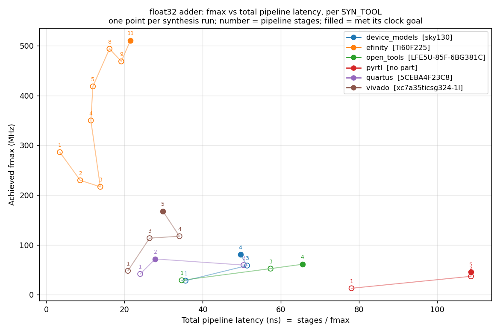

# Pypeline test suite

`src/tests/pypeline_tests/` exercises the Pypeline compiler end to end against real
`.py` design files in `inst/`. There is no test-discovery mechanism -- every test is a
hand-written entry in one of eight category modules, run together via `run_all.py`.
Two of those modules, `synth_tests.py` and `build_report_tests.py`, each feed one
category per synthesis tool -- one pair for every backend `pypelinec` can select
(see [Choosing a synthesis tool](#choosing-a-synthesis-tool)).

> **Reference, not a logbook.** Describe the system as it is now, in the present
> tense. No dated entries, no session write-ups — `git log` is the change record.
> When behavior changes, edit the affected section in place; when the *reason* is
> worth keeping, revise the matching entry in this file's `History` section rather
> than appending a new one. See
> [documentation conventions](pypeline_DESIGN.md#documentation-conventions).

## Categories

| Category | What it checks | Verdict |
|---|---|---|
| `native_sim` | Python golden-model checks (`sim_call`) and `pypeline_sim.py` multi-MAIN runs; fixed user pipelines selectively prepare alignment | exit code, plus in-process `assert`s |
| `native_vs_vhdl_sim` | Runs a design's native (Python) sim and its real cocotb+GHDL sim via `pypeline_sim_debug.py`, and diffs their `sim_print(..., debug=True)` output cycle by cycle | exit code (MATCH/MISMATCH) |
| `elab` | `pypelinec --no_synth` -- does it elaborate | exit code only |
| `elab_introspect` | Calls `PY_TO_LOGIC.PARSE_FILE` in-process and asserts on `parser_state` / `FuncLogicLookupTable` / a raised `ElaborationError`'s type and message | in-process `assert`s |
| `unit` | Pure compiler-helper tests against hand-built fixtures -- no design build | in-process `assert`s |
| `synth_<tool>` | Full elaboration + auto-pipelining + synthesis (no `--no_synth`), with the tool the category names (`synth_tests.py`). One per backend: `device_models`, `vivado`, `pyrtl`, `quartus`, `open_tools`, `diamond`, `efinity`, `gowin`, `cc_tools` | exit code, plus the tool check |
| `build_report_<tool>` | Wrapper scripts that run `pypelinec` themselves and assert on its build log or generated artifacts (mapped cell counts, `TIMING NOT MET` text, `sweep_history.json`), with the tool the category names (`build_report_tests.py`). Wrappers that run no synthesis at all live in `build_report_device_models` | in-process `assert`s over subprocess output, plus the tool check |
| `known_issues` | Reproducers for known, unfixed compiler bugs. **Excluded from `run_all.py`'s default set** -- run explicitly with `--category known_issues`. Every entry has `expect_fail=True`: a passing run means the bug is still present (XFAIL); a clean run means it got fixed without the test being updated (XPASS, reported as a *failure* -- promote the test out of this category) | inverted exit code (or, where exit code doesn't capture the issue, an explicit log-content assertion -- see that entry's own docstring) |

Every backend gets both categories even when it has nothing tool-specific to
check, so the [per-SYN_TOOL sweep matrix](#per-syn_tool-sweep-coverage) has
somewhere to land and a new backend test has an obvious home. Several of those
categories are empty; an empty category costs nothing to run.

`elab_introspect` vs `unit` is decided by the file's *purpose*, not by whether
`PARSE_FILE` happens to appear in it: a 600-line scheduler/codegen test that calls
`PARSE_FILE` incidentally is `unit`; a test whose whole point is parsing a design and
inspecting the resulting `parser_state` is `elab_introspect`.

## Naming convention in `inst/`

- `*_test.py` -- a registered test file. Every one **must** appear in some category
  module's list (enforced by `registration_audit_test.py`, in `unit`).
- `*_design.py` -- a fixture another test builds or imports. Never registered directly.
- `_test_main.py` -- shared `__main__` harness (leading underscore, not a test).

A fixture that another test builds as a subprocess may instead live one level up, in
`src/tests/pypeline_tests/` itself, keeping its original `*_test.py` name -- e.g.
`auto_fsm_resources_test.py`, `auto_fsm_div_share_test.py`, `auto_fsm_tighten_test.py`,
each built by a corresponding wrapper in `inst/`. Being outside `inst/` is what keeps
them out of the registration audit; they are not part of the `run_all.py` suite.

## Adding a test

Prefer adding a `test_*` function to an **existing** file over creating a new one --
each registration pays its own elaboration/synthesis/GHDL start cost, so fewer, larger
files are the goal, not more files. A file's `__main__` block should read:

```python
if __name__ == "__main__":
    from _test_main import run_module_tests
    run_module_tests()
```

`run_module_tests()` auto-discovers every `test_*` callable defined at module scope
and runs it, so adding a function is enough -- no separate `__main__` call list to
remember to update. It only fires under `python3 inst/X.py` (`__name__ ==
"__main__"`); `pypelinec` imports the same file as module `"pypeline_design"`
(`PY_TO_LOGIC.PARSE_FILE`), so `elab`/`synth_*`-category registrations of a file never
run its `test_*` functions -- those categories check elaboration/build only.

## Choosing a synthesis tool

Synthesis is nearly all of the suite's runtime, so every synthesizing test uses the
fastest tool that can check what it tests. The exception is the
[per-SYN_TOOL sweep matrix](#per-syn_tool-sweep-coverage), whose whole purpose
is to run one design on *every* backend.

- **`device_models` (sky130, the default).** Real sky130 liberty STA
  ([`DEVICE_MODELS_DESIGN.md`](DEVICE_MODELS_DESIGN.md)), selected with
  `--syn_tool device_models` or `PART("sky130...")`. Every sky130 spelling shares
  the one committed `cache/delay/device_models_sky130_fd_sc_hvl_tt_025C_3v30_v4`
  cache: the library and corner are fixed, and the part string is not part of
  the cache key. Note this tool can no longer be forced onto a design whose
  `PART` selects another backend -- a part and a tool that disagree are a hard
  error ([`SYN_DESIGN.md` §2](SYN_DESIGN.md#2-choosing-a-tool)), so a design
  meant to be built under several tools simply sets no `PART`.
- **`vivado`, only for Vivado-specific features.** Today that means MULTI_CYCLE
  path constraints (`AUTO_MULTI_CYCLE.GET_MCP_PATH_CONSTRAINTS` supports only Vivado) and
  the PDW synth tops' real-part Block RAM and 125 MHz checks. Use a part with
  a committed cache (`xc7a35ticsg324-1l`, `xc7a100tcsg324-1`); a part without
  one re-characterizes every leaf on every run.
- **`pyrtl`, only for PyRTL-specific behavior.** Two tests use it:
  - `pyrtl_no_timing_paths_build_report_test.py` guards a fix inside
    `PYRTL.py`: a netlist with no timing paths used to divide by zero there.
    sky130 has its own equivalent error, which passes the same assertions,
    but running the test under sky130 would leave the PyRTL fix untested.
  - `auto_fsm_ctl_compare_test.py` makes two claims, both calibrated to
    PyRTL, and both fail as stated under sky130:
    - ctl v3 is no bigger than v2 in generic yosys cells. Under sky130
      mapping, the same schedule's v3 comes out 1.9% larger in both cells and
      µm².
    - The donut's v3 FSM meets 40 MHz on its first schedule. Under sky130 it
      reaches 39.26 MHz and passes only after one tightening.

  Each *feature* test runs under exactly one tool. `sweep_floor_detect_test.py`
  runs under sky130 (100 MHz goal) and checks the prediction-independent
  `plateau` stop (`SWEEP.AT_PLATEAU`). Its `--syn_tool pyrtl` mode (50 MHz,
  `empirical_floor` stop) is kept for manual runs but not registered. The
  sweep matrix below is the deliberate exception: there, running the same
  design on every tool *is* the test.

How a test picks its tool:

- **`synth_tests.py`** entries carry the tool as their last field. The
  registration appends `common.SYN_TOOL_ARGS[tool]`, which is uniformly
  `--syn_tool <tool>` now that the flag accepts every backend, so design files
  stay tool-neutral. A design may still set its own `PART` (board examples keep
  their board part, the PDW tops keep theirs) as long as that part selects the
  same tool the entry names.
- **`native_vs_vhdl_sim_tests.py`** builds its non-`--comb` entries under
  sky130 (`NON_COMB_SYN_TOOL`, passed as `--syn_tool device_models`). `--comb`
  entries never reach synthesis.
  - **Warm copies:** `pypeline_sim_debug.py` builds once into
    `<out_dir>/build`, then runs its native and VHDL invocations concurrently,
    each in its own copy of that directory (`<out_dir>/native`,
    `<out_dir>/vhdl`).
  - **Why they stay warm:** DEVICE_MODELS records VHDL inputs relative to the
    output directory, and generated VHDL is the same in every parse pass of a
    run (`c_structs_pkg` only grows; shared built-in entities name no call
    site). Before these fixes, each copy re-synthesized most leaves.
  - **History:** these entries once ran under PyRTL. The two sims shared one
    out_dir, and sky130 synthesis of the same leaf from both processes
    collided at random (composition, AUTO_FSM and RAM tests).
- **`build_report` wrappers** pass `--syn_tool device_models` (or their design sets the
  `PART`) in the `pypelinec` command they build.
  - The sky130 AUTO_FSM cell-count comparisons (resources, area search,
    minimum area) read the mapped sky130 cell count (`N cells:`) from the
    DEVICE_MODELS STA report under `<out_dir>/top/`.
  - The two that check AUTO_FSM's abstract area model
    (`auto_fsm_area_sweep_compare_test.py`, `auto_fsm_min_area_verify_test.py`)
    also pass `--auto_fsm_abstract_area`. Under DEVICE_MODELS the search would
    otherwise rank by real sky130 area, which
    `auto_fsm_real_area_compare_test.py` covers.

**The tool check.** After a `synth_*` or `build_report_*` test runs,
`common.run_test` reads which tools actually synthesized, from the log's
`Running: .../<tool>_....log` lines. The test fails if any other tool ran.
`synth_*` tests must also show at least one run of their own tool. SYN's
`Using <TOOL> synthesizing` line is ignored: it reports only tool selection,
which `--no_synth` builds print too.
`build_report_*` wrappers may not echo their child builds, so only the
wrong-tool half applies to them.

**Whole-design synthesis cost.** sky130 is not faster for every design.
`vga_donut.py` stays on its board's Vivado part: sky130's whole-design yosys
run sat in `opt -full` for over an hour on its flattened wide multipliers,
while Vivado takes about 30 minutes.

**Clock goals.** Keep a sweep test's MHz goal low enough that it settles in a
few synthesis iterations, unless pushing the sweep is the point of the test
(`sweep_floor_detect_test.py`, `auto_fsm_timing_iter_test.py`,
`auto_fsm_tighten_stall_test.py`, the unreachable
half of `auto_pipeline_constraints_test.py`). Keep it above the design's
unpipelined fmax wherever the test needs a real pipeline cut.

**Graph rendering is off.** `run_test` sets
`PIPELINEC_INTERNAL_SKIP_PIPELINE_MAP_PNG=1` for every test, and wrapper
subprocesses inherit it. Graphviz `pipeline_map` renders cost more than many
whole tests and nothing reads them; the text `pipeline_map.log` is still
written.

## Per-SYN_TOOL sweep coverage

`inst/sweep_float32_test.py` -- a single float32 adder `@MAIN`, the Pypeline
twin of `examples/pipeline.c` -- is registered once per backend in
`synth_tests.py`, giving every synthesis tool one real planned throughput
sweep. Before this, six of the nine backends had no test at all: `quartus`,
`open_tools`, `diamond`, `efinity`, `gowin` and `cc_tools` could break and
nothing would notice.

**One design file, not nine.** The design sets no `PART`. Each registration
passes only `--syn_tool <tool>`, and the tool's own `DEFAULT_PART`
(`src/<TOOL>.py`) supplies the part -- so every backend builds *the same*
design and a failure is about the backend, nothing else. This is what
`--syn_tool` accepting every tool bought.

**Per-tool clock goals** come from `synth_tests.SWEEP_FLOAT32_MHZ`, passed via
`Test.env` as `SWEEP_FLOAT32_MHZ`. A float32 adder's unpipelined fmax differs
by an order of magnitude between an ASIC standard-cell model and an FPGA, so
one shared goal would either cut nothing on the fast tools or churn on the
slow ones. Each goal sits above the design's comb fmax (so the sweep must
place real cuts) and low enough to settle in a few iterations.

**Cost.** `quartus`, `open_tools`, `efinity` and `cc_tools` return `True` from
`SYN.TOOL_DOES_PNR()`, so every uncached leaf is a full place-and-route run,
and no committed cache holds this design's `float_8_23_t` leaves. The first
run on those tools is slow; afterwards the cache carries it.

**Measured comb fmax**, which is what each goal is set from:

| backend | part | comb fmax | goal | settles at |
|---|---|---|---|---|
| `pyrtl` | *(none -- tech node, not a part)* | 12.80 MHz | 40 | 46.0 MHz @ 5 stages |
| `device_models` | `sky130` | 28.06 MHz | 60 | 80.5 MHz @ 4 stages |
| `quartus` | `5CEBA4F23C8` | 41.58 MHz | 60 | 71.7 MHz @ 2 stages |
| `open_tools` | `LFE5U-85F-6BG381C` | 28.84 MHz | 60 | 61.0 MHz @ 4 stages |
| `vivado` | `xc7a35ticsg324-1l` | 47.84 MHz | 130 | 167.3 MHz @ 5 stages |
| `efinity` | `Ti60F225` | 286.17 MHz | 500 | 510.4 MHz @ 11 stages |

**Comb fmax is only meaningful next to the goal it was measured under, and
only for Quartus.** Measured with a deliberately slack 1 MHz goal instead of
the real one, `quartus` reports 28.21 MHz rather than 41.58 -- its fitter
works to the constraint. Every other backend here returned an identical number
under both (`pyrtl` 12.804, `device_models` 28.056, `open_tools` 28.840,
`vivado` 47.9, `efinity` 286.171), so this is a Quartus behavior, not a
place-and-route-versus-estimate split. `sweep_float32_tool_compare.py` always
builds its comb reference point under the same goal as the sweep, so each
tool's curve is internally consistent.

Three backends are in `known_issues` instead, none for a PipelineC bug:

| backend | why |
|---|---|
| `gowin` | `gw_sh`: "License verification failed  License hostid not match" |
| `diamond` | `diamondc`: "License checkout failed. FlexNet Licensing error:-10,32" |
| `cc_tools` | yosys synthesis succeeds, then CologneChip `p_r` crashes inside itself ("Exception Handler called. ExitCode: 112, Exception Class: ERangeError"). It is fed 357 inputs / 480 outputs, far past a CCGM1A1's real I/O count |

`efinity` is registered with `-j 1` (`SWEEP_FLOAT32_EXTRA_ARGS` in
`synth_tests.py`). Its `efx_pnr` builds a whole Titanium routing graph per leaf
and peaks near 3.7GB resident, so the default four parallel jobs exhaust a 16GB
machine; the build then fails with a missing `.timing.rpt` while the OOM killer
takes whatever had the worst `oom_score` -- usually an editor, not the build.
It is the only backend here that needs the cap.

`efinity` reporting 128.84 MHz comb -- roughly four times every other backend
for the same logic -- is expected, not suspicious: `Ti60F225` is a 16nm
Titanium part, against 28nm for the Cyclone V and Artix-7, 40nm for the ECP5
and 130nm for the sky130 standard cells. Its goal is scaled to match.

A large part is also *required* here, not a choice. Efinity has no
out-of-context synthesis mode, so every leaf is built as a real top level with
real I/O pins; the float32 adder's internal leaves (ex. `int25_t + int25_t`)
need far more pins than a small Trion device such as `T8F49` physically has.
That is also why each run is expensive -- `efx_pnr` builds the routing graph
for the whole 218x322 Titanium fabric every time.

The three blocked backends are registered in `known_issues_tests.py`
(`SWEEP_FLOAT32_BLOCKED`) with `expect_fail=True`, not in their `synth_<tool>`
category: none of the three failures is a PipelineC bug, so a default run
should not pay for them. A fixed license, or a part/tool combination `p_r`
accepts, turns the entry into an XPASS -- which is the signal to move it back
into `synth_<tool>`.

**Cross-tool comparison.** `sweep_float32_tool_compare.py` (opt-in, outside
`run_all.py`) builds the same design on every backend -- `--comb` first for the
unpipelined reference point, then the sweep -- and overlays every backend's
iterations on one plot: total pipeline latency (stages / fmax) on X, achieved
fmax on Y, one curve per tool labelled with the part it used. Each point is one
real synthesis run annotated with its pipeline stage count, so the curve shows
what added stages actually bought on that tool.



```
python3 src/tests/pypeline_tests/sweep_float32_tool_compare.py --out_root DIR
```

The curves are not all monotonic, and that is the measurement rather than a
bug. On `quartus` the 3-stage result came out slower than the 2-stage one, and
on `vivado` the 4-stage result is slower than the 3-stage. `efinity` is the
clearest case: its first two cuts made the design *worse* than unpipelined
(286 -> 230 -> 217 MHz) before it climbed to 510 MHz at 11 stages. Added stages
only help when the tool can place and route the shorter segments, and a deeper
pipeline brings its own placement pressure.

Two reads worth taking from the plot:

- `pyrtl`'s 4-stage and 5-stage points sit at the same 108.7 ns total latency
  while fmax goes 36.8 -> 46.0 MHz. That step is free.
- `efinity` needs 11 stages to reach 510 MHz, against `quartus` reaching
  71.7 MHz at 2. Comparing tools on fmax alone hides that the deeper pipeline
  costs proportionally more latency to get there.

## Fixed user pipeline coverage

`pipeline_latency_test.py` covers `@pipeline_latency` validation and stacking,
factory specialization, fixed-latency metadata across repeated elaboration, serial
and parallel composition, bypass alignment, conditional enables, dynamic array
reads/writes, initialization, reset and convergence. Its subprocess gate tests
forbid importing the pipeline model in untagged `--comb` CLI builds and also
forbid the elaborator in direct native runs, covering arithmetic, registers,
AUTO_PIPELINE and AUTO_FSM. Unrelated roots, zero-cycle declarations and
direct calls to tagged bodies also forbid model preparation.
Alternating live roots check that shared helper models retain separate state.
Explicit placement tests reject cuts both at and inside a fixed boundary.

`pipeline_latency_sim_test.py` runs in both native-versus-VHDL categories, with
and without `--comb`. It checks independently calculated data, sequence order and
constant observed latency for unequal fixed pipelines in both a naturally
pipelined MAIN and an AUTO_PIPELINE region. Valid-gated debug probes compare exact
clock timing against GHDL, including draining the pipeline, register initialization,
synchronous reset and clock enables within a stateful caller.

## AUTO_PIPELINE latency constraint coverage

Each test below covers `AUTO_PIPELINE(func, latency= / start_latency= / max_latency=)`
from a different angle:
- `auto_pipeline_harvest_test.py` (unit):
  - constructor validation;
  - identity suffixes (an unconstrained tag's key and `pypeline_names` identity are
    unchanged);
  - `.latency` per build mode and cache;
  - the served-value predicate behind the pin-and-confirm pass-2 skip;
  - `AUTO_PIPELINE.CHECK_AUTO_PIPELINE_CONSTRAINTS_REALIZED`.
- `auto_pipeline_region_planning_test.py` (unit): `AUTO_PIPELINE.COUNT_TARGETED_PLACEMENTS`,
  plan trimming, cap bookkeeping, and hotspot-to-region attribution on synthetic
  landscapes.
- `auto_pipeline_fixed_latency_sim_test.py` (native_sim): plain native sim emulates a
  fixed latency and ignores start/max. `pipeline_latency_test.py`'s gate test also runs
  it, both directly and through `pypelinec --sim --comb`, with the compiler import
  forbidden.
- `auto_pipeline_constraints_test.py` (build_report_device_models): fixed and start regions are built
  exactly and pass 2 is skipped, and a `max_latency` cap stops an unreachable goal
  promptly.
- `auto_pipeline_c_pragma_test.py` (build_report_device_models): C `#pragma AUTOPIPELINE N` under
  `--comb`.
- `self_check_fixed_auto_pipeline_test.py` (both native_vs_vhdl categories): compares
  the native delay line against the `--comb` VHDL's fixed registers, and against the
  planned sweep's enforced region.

## AUTO_MULTI_CYCLE coverage

`AUTO_MULTI_CYCLE(latency= / start_latency= / max_latency=)` and the multi-cycle stream wrappers:
- `auto_multi_cycle_unit_test.py` (unit):
  - constructor validation and `.latency` resolution;
  - construction-site keys and the inline-construction guard;
  - design-read vs. compiler-read tracking;
  - identity that follows the resolved count;
  - `AUTO_MULTI_CYCLE` constraint overrides and the timing-params hash;
  - `AUTO_MULTI_CYCLE` report matching and grow-only sweep feedback on a synthetic Vivado report;
  - elaboration into `Logic.auto_multi_cycle_tuples`, where a cache re-parse changes the count and
    renames the holding entity;
  - an unread tag refused by `AUTO_MULTI_CYCLE.CHECK_AUTO_MULTI_CYCLE_TAGS_READ`.
- `stream_auto_multi_cycle_test.py` (native_sim and synth_vivado `--comb`): the handshake waits
  `.latency + 1` cycles for `start_latency=` and fixed `latency=`, and the Xilinx-part
  `--comb` build emits both `set_multicycle_path` constraints.
- `stream_multi_cycle_test.py` (native_sim and synth_vivado `--comb`): the fixed
  `make_stream_multi_cycle`.
- `auto_multi_cycle_sweep_test.py` (build_report_vivado, **real Vivado**, `auto_multi_cycle_sweep_design.py`):
  - from the default start, the sweep raises the count until the path meets timing;
    pass 2 re-elaborates, the final XDC carries the count, and the pipelined native
    `--sim`'s `sim_assert` checks the handshake;
  - restarting at that count settles immediately, with pass 2 skipped;
  - `max_latency=1` fails the build naming the cap.

## AUTO_COMB_AREA_OPT coverage

The companion `AUTO_COMB_DELAY_OPT` suite adds `auto_comb_delay_opt_test.py`
(native isolation, dependency timing, exact candidates, casts, arithmetic
families, purity, nesting and repeat-parse pinning),
`auto_comb_delay_opt_build_test.py` (Yosys SAT equivalence, register-free core,
separate original/optimized sky130 timing builds), and stream/composition
native-versus-GHDL fixtures. The stream asserts latency 2, II=1 and stable
data/valid under stalls; composition covers pipeline and FSM.

The FSM unit suite includes a counted diamond-DAG regression against
exponential input-storage traversal. `qor_multiplier_auto_fsm_test` keeps its
1800-second timeout; `auto_fsm_min_area_verify_test` keeps 2700 seconds, all four
real builds and the 3% area tolerance. The latter saves each variant's complete
live output in `build.log`, with elapsed/status summaries. Retaining the
original area incumbent is valid; a search move is not required. See
[`AUTO_COMB_OPT_DESIGN.md`](AUTO_COMB_OPT_DESIGN.md).

`AUTO_COMB_AREA_OPT` is exercised at the callable, graph, RTL and stream boundaries:

- `auto_comb_area_opt_test.py` (`elab_introspect`): metadata/native forwarding,
  generated candidate equivalence, exclusive predicates, multiple consumers,
  signed casts, modular factoring, constant arithmetic, demanded/known bits,
  custom narrow-width operators, scoped fallback, purity and repeat parsing.
- `auto_comb_area_opt_build_test.py` (`build_report_device_models`, Yosys + GHDL): SAT proves
  bit-exact equivalence for all inputs of the two-multiplier/output-mux example;
  independent mapped-cell builds require a strict area reduction and no
  flip-flops/latches in the combinational replacement.
- `self_check_stream_auto_comb_area_opt_test.py` (`synth_device_models`, native-vs-VHDL `--comb`):
  two-cycle registered boundaries, unstalled II=1, bubbles, backpressure and
  stable output while stalled.
- `self_check_auto_comb_area_opt_composition_test.py` (both native-vs-VHDL modes):
  fixed/discovered pipelines, default raw-function FSM and explicit-AUTO_COMB_AREA_OPT FSM. It
  sets no `PART`; the pipelined build runs under `--syn_tool device_models` (see
  `NON_COMB_SYN_TOOL`). There is
  no multi-cycle member: MULTI_CYCLE constraints are Vivado-only, and one used to
  force the whole design onto a slow Vivado sweep. Multi-cycle streams are
  covered by the `synth_vivado`/`build_report_vivado` tests above.

Run the full suite with `python3 src/tests/pypeline_tests/run_all.py -j 5 --no_timeout`.
Use `-k auto_comb_area_opt` to select the feature tests. See
[`AUTO_COMB_OPT_DESIGN.md`](AUTO_COMB_OPT_DESIGN.md) for the contract and limits.

## Global wire name coverage

`local_binds_global_wire_test.py` (`elab_introspect`) covers which names mean a global
wire. Each case writes a small design module to a temp dir and imports it, because
native sim's check fires at decoration time. Elaboration's own check is reached by
stubbing out `pypeline._check_no_local_binds_wire_name`.

- **Local bindings of a wire's name are rejected by both layers.** The forms are an
  annotated local, a `Reg` declaration, a parameter, a for-loop variable and a
  comprehension variable. Sim raises `GlobalWireNameError` with the file and line, and
  `ELABORATE_LIVE_ROOTS` and `PARSE_FILE` raise `ElaborationError`.
- **The same holds for the alias of a wire-declaring module** (`def g(file_a: ...)`),
  and for a sub-file's bare wire name, which is registered as `<module>_arr`.
- **A local in a module that does not declare the wire stays a local.** This covers a
  helper module local `valid` next to a top-file `valid: Wire`, and a local spelled
  like a sub-file wire key (`file_a_o`). The test asserts the helpers have no global
  wires or readback inputs and that the only writer is the real one. Both elaboration
  paths are checked.
- **Positive control:** an ordinary same-module `acc = x` still writes the wire.
- **Unpacking into wires** (`acc, b = ...`, `b, acc2 = acc, b`) writes the wires in sim.
  The RHS is evaluated first, a typed local leaf is still truncated, and the claim reset
  zeroes the wires on the next invocation. Elaboration registers both wires as written.

All cases except the positive control fail on the tree before the fix.

## RAM coverage

`make_ram` (`include/pypeline/ram.py`) and `make_stream_ram` (`stream/stream_ram.py`) share one
VHDL generator and one simulation model. Coverage:

- **`ram_test.py`** (`native_sim` and `synth_device_models --comb`).
  - Six `@MAIN` shapes, each with its own generated raw VHDL: single port, struct elements
    with a non-power-of-two size, two ports with input/output registers, an array register
    file, byte write enables, and a string ROM.
  - `sim_call` tests: latency and pass-through fields, read-first reads, write collisions,
    init forms and validation, instance independence and `sim_reset`, same-cycle
    re-evaluation, stateful versus pure (aligned) callers.
  - Seeded soaks against a reference with no stage bookkeeping: a request's read sees
    exactly the writes of earlier requests.
  - A `PARSE_FILE` check that every generated RAM carries its `func_fixed_latency`.
- **`stream_ram_test.py`** (`native_sim` and `synth_device_models --comb`): ready-as-clock-enable stall
  hold, bubble fill, exactly one write per accepted request, independent ports, latency 0,
  and a random-backpressure replay.
- **`ram_sim_model_test.py`** (`native_sim` via `pypeline_sim.py --run 30`): convergence
  safety of the shared-memory model. RAM accumulators are closed through wires, so every
  cycle re-evaluates them with stale inputs. Mutation-checked: a model that writes from
  re-run evaluations never converges.
- **`self_check_ram_test.py`** (both `native_vs_vhdl_sim` modes, plus `native_sim`):
  - init readback across element types (`uint1_t`, `int1_t`, 64-bit signed, enum, struct,
    2-D array, `char_t[8]`, fixed, float);
  - latency-3 traffic and byte write enables;
  - a pure `@MAIN(100.0)` aligned around the RAM;
  - a stream RAM under backpressure.

  The checker MAIN returns a value on purpose. A design with no top-level outputs synthesizes
  to nothing, and a pipelined build then fails with a clear "no timing paths" error (see
  `pyrtl_no_timing_paths_build_report_test.py` below). The pure MAIN is no longer needed to
  keep the build off the coarse sweep: a single stateful MAIN with no target MHz is now
  characterized as written (see `single_stateful_main_fixed_latency_test.py`).
- **`single_stateful_main_fixed_latency_test.py`** (both `native_vs_vhdl_sim` modes): the only
  `@MAIN` is stateful, has no target MHz, and calls `@pipeline_latency(3)` with a narrower
  argument expression (`delay3(c + 100)`). A pipelined build used to force it into the coarse
  sweep, which crashed with `Trying to slice into ... for no reason`, for ANY single stateful
  goal-less MAIN, fixed-latency child or not. It now takes the planned sweep's one-synthesis
  characterization with zero added latency.
- **`call_arg_width_test.py`** (`native_vs_vhdl_sim --comb`): scalar int call arguments whose
  type differs from the parameter's: a uint9 expression into `uint16_t`, sign extension, a
  truncation into a narrower parameter, uint into int, and keyword-bound arguments. The call's
  port wire used to take the argument's type, and GHDL rejected the port map
  (`actual constraints don't match formal ones`).
- **`pyrtl_no_timing_paths_build_report_test.py`** (`build_report_pyrtl`): the no-output
  `no_outputs_design.py` must FAIL its pipelined build, and fail with the PYRTL no-timing-paths
  error text (naming `@wires` as the intentional-wiring escape). The old
  `ZeroDivisionError` / `could not convert string to float` text and the coarse-sweep crash
  must not appear. A circuit with no paths has no Fmax; that is never a passing measurement.

## Generated-name regression coverage

`interface_factory_two_widths_test.py` is a normal synthesis test: the same design
instantiates broadcasts and skid buffers at four and eight byte lanes using their
original interface objects. `generated_naming_test.py` checks structural identity,
interface pairing and direction, typed parameter distinctions, returned-factory
closure identity, readable record names, overflow, case-insensitive collisions and
VHDL lexer/idempotence behavior.

`generated_naming_build_test.py` builds that design in two fresh processes with
separate output directories and different `PYTHONHASHSEED` values. It compares all
VHDL paths and bytes, checks name length and source/index coverage, and imports and
elaborates the real top with GHDL. `name_index_test.py` covers source tracing,
same-spelling definitions that must coexist, and a deliberately forced identity
collision that must fail clearly. Existing AUTO_FSM and native-versus-VHDL tests
exercise generated helpers and specialization reuse in real hardware builds.

**Tool-side file names.** Generated entity names can also overflow file names
that a synthesis backend builds from them. Two tests cover this:

- **`device_models_sta_test.py` (unit):** `test_artifact_paths_fit_filename_limit`
  checks that every DEVICE_MODELS synthesis artifact name stays within 255
  bytes, including its temporary-netlist tail. It checks every recipe, and uses
  both real soft_cmp leaf names and oversized names.
- **`self_check_stream_auto_fsm_test` (synth_device_models):** builds the
  AUTO_FSM design under `--syn_tool device_models`, whose soft_cmp leaves first exposed
  the overflow. Every `synth_device_models` build with long factory names
  (stream AUTO_PIPELINE, soft_div) exercises the same path. See
  `DEVICE_MODELS_DESIGN.md` §2.

**Warm output directories.** A copy of a warm output directory, or a warm
rerun, must reuse its cached leaf results. `pypeline_sim_debug.py` depends on
this, and the non-`--comb` `native_vs_vhdl_sim` entries exercise it end to
end. Three tests cover it:

- **`warm_copy_no_resynth_test.py` (build_report_device_models):** builds
  `self_check_auto_fsm_test.py` under sky130, copies the output directory,
  and rebuilds in the copy. The rebuild must re-synthesize no DEVICE_MODELS leaf and print
  no cache-mismatch line. It fails if any of the three fixes below is
  reverted.
  - The design matters: its AUTO_FSM passes differ in `c_structs_pkg` types
    and in which call site first elaborates a shared built-in.
  - `auto_fsm_test.py` has neither flip. It only catches the absolute-path
    regression.
- **`device_models_sta_test.py` (unit):**
  `test_synthesis_identity_survives_copying_the_output_directory` checks that
  a copied output directory keeps the same synthesis identity. VHDL inputs are
  recorded relative to the output root, and the mapped netlist relative to its
  log.
- **`generated_vhdl_stability_test.py` (unit):** checks that generated VHDL
  doesn't change between parse passes:
  - `c_structs_pkg` only grows: a pass with no new types leaves the file
    untouched, new types are appended after the existing ones, and a
    redefined type or a changed preamble starts the package over;
  - a shared C built-in operator entity gets no call-site `-- Source:`
    comment;
  - an identical re-render doesn't rewrite the file (`WRITE_TEXT_IF_CHANGED`),
    so a thread reading it never sees it truncated.

## Operator-cost regression coverage

The `include/pypeline/` libraries are audited for operations built out of
primitives heavier than the operation needs — a two's-complement negate
emitted as an HDL multiply, a one-bit inversion emitted as a subtract. These
are correctness-neutral in principle and value-wrong in practice if the
replacement is written even slightly wrong, so each one is pinned by a native-sim
golden rather than by a build.

- **`soft_ops_test.test_soft_cmp` / `test_soft_cmp_mixed_width` (native_sim):**
  all six comparator flavors `soft_cmp.py` exposes (`sub`, `sub_swapped`,
  `borrow`, `bitwise`, `prefix`, `chunked`) × `GT`/`GTE`/`LT`/`LTE` × signed and
  unsigned, plus mismatched widths and mixed signedness, against Python
  comparison as golden.

  All six flavors are covered, not just the default one: most of the library's
  one-bit inversion logic lives in the five non-`sub` flavors. Mutation-checked —
  breaking one sign-bit term in the prefix flavor produces 76 failures, all in
  `soft_cmp_prefix_s_*`. `make_soft_cmp_chunked` is
  instantiated with `chunk_bits=3` against 6-bit operands on purpose, so both
  the leaf scan and the cross-chunk select tree run; `chunk_bits=8` would
  collapse it to one chunk and never reach `_make_prefix_tree`.
- **`soft_ops_test.test_soft_negate` (native_sim):** signed *and* unsigned
  operands. The unsigned case is the one that matters — negating an unsigned
  value is where a same-width two's-complement negate silently returns the
  unsigned wrap instead of a negative number.
- **`float_ops_test.test_negate_primitive` (native_sim):** `_make_negate` at all
  three width shapes the float library instantiates — widening
  (`uint24_t → int25_t`), narrowing (`int26_t → uint25_t`) and same-width signed
  (`int32_t → int32_t`) — against `(-a) % 2**out_width`. Pinned separately from
  the float adders because those only ever feed it values whose negation is in
  range; a negate wrong at the edges would still pass them.
- **`fixed_point_test.test_unary_negate` (native_sim):** sweeps the whole
  representable range, not two spot values, plus the documented
  most-negative-wraps-to-itself case.
- **`fir_test` (native_sim):** `test_symmetry_fold_bit_identical`,
  `test_antisymmetric_fold` and `test_halfband_zero_tap_skip` between them cover
  all three `SGN[j]` values, so they pin the elaboration-time branch that
  replaced `SGN[j] * window[B[j]].val`.

## `native_vs_vhdl_sim` probe rules

A design registered in `native_vs_vhdl_sim_tests.py` must:

- Emit at least one `sim_print(..., debug=True)` probe covering the values its
  `sim_assert`s already check.
- **Never** emit a `debug=True` print on the same cycle `sim_finish()` is called.
  Whether a same-cycle VHDL write flushes before `std.env.finish` kills GHDL is a
  process-ordering race the diff must not depend on -- the print is silently DROPPED
  from the VHDL/cocotb log entirely if this rule is broken (present in native sim,
  absent in VHDL -- not a text-visible failure, just a missing line the cycle diff
  will flag as a mismatch). This is a documented tool constraint, not a compiler
  bug -- see `known_issues_tests.py`'s `sim_finish_debug_print_race_test` for a
  direct reproduction of what happens if it's broken, and e.g.
  `self_check_counter_test.py` for the standard one-cycle gate
  (`if n < NUM_COUNTS - 1: sim_print(...)`).
- For a non-`--comb` (pipelined) entry: put every probe inside a stateful (0-latency)
  MAIN, and valid-/count-gate it, since VHDL's undefined (`'U'`) warm-up registers
  can't be compared against native's typed zeros.

- Keep every probed value under 2**31 if it is a `uint32_t`. `sim_print` lowers to
  `integer'image(to_integer(x))` and VHDL's `integer` is 32-bit *signed*, so GHDL
  aborts with `overflow detected` on a larger value while native sim prints it
  happily -- a VHDL-only failure by construction. `self_check_type_axis_test.py`
  carries a comment marking where it deliberately stays under the limit.

See `docs/pypeline_sim_DESIGN.md`'s Limitations section for the full contract
(including the two hard-error cases enforced by the elaborator/simulator directly).

## Testing generated host code

The standalone host module a build writes to `<out_dir>/host/` (see
[Host-Side Generated Types](pypeline_guide.md#host-side-generated-types)) is tested in a
way worth copying whenever "this artifact must work somewhere else" is the claim:

- `inst/host_types_test.py` (`native_sim`) checks the GENERATOR. It runs the generated
  text in a **subprocess whose `sys.path` cannot reach this repo** — and which asserts
  `import pypeline` fails before doing anything else — then compares what that process
  decodes and encodes against `pypeline.type_to_bytes`/`type_from_bytes`, over random
  frames in both endians.
- `inst/host_types_build_test.py` (`build_report_device_models`) checks the BUILD: it runs `pypelinec`
  for real, lifts the file out of the output directory, and repeats that comparison on it.

Two rules make those tests mean something, both learned by mutation-testing them:

- Drive them with **raw random bytes, not bytes canonicalized through pypeline first**. A
  canonicalized frame already has every ragged leaf (`uint3_t`) reduced to fit, so a
  generator that masked such a leaf to a whole byte decodes it identically and the bug
  walks straight through. Raw bytes force each leaf's mask to discard something.
- Compare the DECODED value field by field, not just the re-encoded bytes. Round-tripping
  inside the generated module alone passes for any self-consistent layout, including a
  wrong one — which is the exact failure mode (a well-formed frame of the right length,
  loading the wrong values) that generating the host's copy exists to prevent.

## Running

```
python3 src/tests/pypeline_tests/run_all.py                       # default categories, parallel
python3 src/tests/pypeline_tests/run_all.py -j 5 --no_timeout     # full suite, five workers, no timeout
python3 src/tests/pypeline_tests/run_all.py --category native_sim
python3 src/tests/pypeline_tests/run_all.py --category synth_device_models --category build_report_device_models
python3 src/tests/pypeline_tests/run_all.py --category synth_vivado --category build_report_vivado  # needs Vivado
python3 src/tests/pypeline_tests/run_all.py --category synth_quartus   # needs Quartus; likewise synth_<any backend>
python3 src/tests/pypeline_tests/run_all.py -k sweep_float32           # the per-SYN_TOOL sweep matrix, every backend
python3 src/tests/pypeline_tests/run_all.py --category known_issues   # opt-in
python3 src/tests/pypeline_tests/run_all.py -t <name>              # one test, by name or list index
python3 src/tests/pypeline_tests/run_all.py -k <substring>          # tests whose name contains SUBSTRING
python3 src/tests/pypeline_tests/run_all.py --list                  # print the numbered list, don't run
python3 src/tests/pypeline_tests/run_all.py --timeout 60             # override every test's timeout
```

A `synth_<tool>` / `build_report_<tool>` category needs that tool installed.
The backends are found by `PATH` first and then a hardcoded fallback path in
`src/<TOOL>.py`, so a tool that is installed but not on `PATH` still works --
which also means `Test.requires=` (a `shutil.which` check) cannot gate these
categories, and a missing backend shows up as a failure rather than a skip.

```
python3 src/tests/pypeline_tests/sweep_float32_tool_compare.py --out_root DIR
```

builds the float32 adder on every backend and plots fmax against total
pipeline latency, one curve per tool. Opt-in, outside `run_all.py`.

Each test gets an isolated `--out_dir` under a fresh tmp root (`common.py`'s
`make_tmp_root()` / `run_test()`), so tests run in parallel safely; a per-category
default timeout (`common.DEFAULT_CATEGORY_TIMEOUT_S`, overridable per `Test` or via
`--timeout`/`--no_timeout`) kills a hung subprocess instead of blocking the whole
suite. A summary table reports PASS/FAIL/XFAIL/XPASS/SKIP/TIMEOUT per test, with
output directories of any failed test printed for inspection (and, for a tool-check
failure, which tool the log named). `run_test` also sets
`PIPELINEC_INTERNAL_SKIP_PIPELINE_MAP_PNG=1`; see
[Choosing a synthesis tool](#choosing-a-synthesis-tool).

Each category module can also run standalone, e.g.
`python3 src/tests/pypeline_tests/native_sim_tests.py [-j N]`. Run standalone,
`synth_tests.py` and `build_report_tests.py` run all three of their tool
categories.

## Related

- `src/tests/pypeline_tests/op_qor_bench.py` -- QoR benchmark (not a correctness test,
  not part of `run_all.py`), driving `pypelinec --coarse --sweep` and comparing yosys
  cell-count estimates against synthesized results across the operator library.

- Carry-save multiplier first-candidate QoR probe -- a manual, opt-in sky130
  acceptance check using the external latchup `solution.py`. Variants change
  only `CLK_RATE_MHZ`; the latchup-equivalent command is:

  ```text
  pypelinec <solution.py> --no_sweep --no_hier_syn --out_dir <out>
  ```

  Accepted model-V4/`early_flatten_noabc` results, with timing inputs held
  fixed, are:

  | requested MHz | added-clock latency | comb stages | measured fmax |
  |---:|---:|---:|---:|
  | 700 | 30 | 31 | 700.640825 MHz |
  | 701 | 59 | 60 | 909.794952 MHz |
  | 720 | 60 | 61 | 909.794952 MHz |
  | 905 | 60 | 61 | 909.794952 MHz |

  The 700 MHz result is the preserved baseline; the first deeper family at a
  701 MHz request is 29.852% faster and remains below 64 stages. The accepted
  mapped candidate has 7,164 cells, 4,605 sequential cells, and zero unmapped
  cells. The exact 720 MHz final VHDL passes 51 products with continuous data,
  bubbles, ordering, and exact 60-clock latency.

- `src/tests/pypeline_tests/divider_qor_bench.py` -- opt-in sky130 auto-pipelining
  benchmark and correctness gate, also excluded from `run_all.py` because a full gate
  Divider sweep can take about an hour. It has unchanged-logic arithmetic and gate-level
  143 MHz fixtures under `qor/divider/`. A normal run records a machine-readable
  `manifest.json` containing source/compiler/tool/liberty hashes, placement trace,
  exact final VHDL hashes, mapped-cell histogram/DFF count, timing components, runtime,
  and the acceptance verdict:

  ```text
  python3 src/tests/pypeline_tests/divider_qor_bench.py \
    --variant gate --out_dir /tmp/divider_gate
  ```

  The gate verdict requires correct final-VHDL output, fmax strictly above 143 MHz,
  and no more than 48 slices (49 combinational pipeline stages). The arithmetic
  regression requires the same correctness/fmax checks and at most 63 slices.
  The harness first copies the exact ordered `vhdl_files.txt` bytes into an
  evidence snapshot. Simulation compiles that snapshot with the pinned GHDL,
  and the accepted timing/cell result comes from remapping the same immutable
  snapshot rather than whichever netlist happened to be produced by the last
  sweep probe. It checks
  continuous-valid traffic, bubbles, edge cases, divide-by-zero, ordering, valid
  latency, input readiness, and pipeline flush. The fixture has no output-ready port,
  so this test intentionally makes no output-backpressure claim.

  `qor/divider_qor_acceptance.json` holds the acceptance record, taken under the
  V3 production recipe (`early_flatten_opt`, full decision in
  `qor/synthesis_recipe_forced32_matrix.json`): the automatic gate result is
  160.43 MHz at 31 slices / 32 combinational stages, and the arithmetic result is
  180.05 MHz at 32 slices / 33 stages. Both exact final-VHDL runs pass 141
  ordered vectors, have zero unmapped cells, and satisfy their slice limits.
  The corresponding clean-commit baselines required 66 and 64 slices. The
  current production recipe is `early_flatten_noabc` (see
  [`DEVICE_MODELS_DESIGN.md`](DEVICE_MODELS_DESIGN.md#history)'s History
  section) — this V3-era acceptance record has not been re-taken against it.
  Full sky130 runs remain opt-in.

  Controlled physical and recipe experiments remain internal to this harness. Use
  `--placement step-boundaries` to force every gate `step_gates` output boundary, or
  `--placement step-boundaries-div0` for the divide-zero-select output followed by
  the first 31 repeated-step outputs (32 slices / 33 combinational regions);
  `--elaborate-only --diagnostic` to emit/check that placement without a timing sweep;
  or `--frozen-vhdl-source <run>` with one of the fixed recipe IDs to remap byte-identical
  VHDL without re-planning. There is no arbitrary synthesis-flags or public slice-cap
  interface. A timing-miss compiler exit does not suppress exact-VHDL simulation when
  the final artifacts were still written. To import an already-completed run whose
  stdout was not redirected, use `--existing-build --existing-latency N` and optionally
  `--existing-runtime-seconds S --existing-returncode RC`; the return code is
  required for a non-diagnostic acceptance import. The manifest marks any pre-existing `build.log` as
  incomplete/unverified rather than presenting an injected depth line as full stdout.
  `--compiler-commit` and `--source-sha256` attach the compiler/source snapshot which
  actually launched that completed build; the manifest records the current worktree
  separately so later documentation changes cannot be misattributed to the old run.
  Normal and frozen runs reject nonempty destination directories, liberty
  overrides, source drift during the run, mismatched recipe/model identities,
  unmapped cells, incomplete topology, or a timing report whose VHDL/mapped
  hashes do not match the immutable snapshot. A nonzero simulator return code
  cannot be overridden by a stale `functional_results.json` pass marker.
- `src/tests/pypeline_tests/divider_continuity_bench.py` -- opt-in arithmetic-
  only model-V4 continuity benchmark, also excluded from `run_all.py`. It
  requires the unchanged latchup source SHA-256
  `cfde3ad82985716544df580bb9415c6cbc4efa03ed4687b14a774e1bda56f70f`,
  derives temporary variants by changing only `CLK_RATE_MHZ`, and rejects any
  change to `DEVICE_MODELS.py` or the `early_flatten_noabc` identity. A full
  run is:

  ```text
  python3 src/tests/pypeline_tests/divider_continuity_bench.py \
    --out_dir /media/1TB/tmp/divider_continuity
  ```

  It scans the requested-frequency/first-plan frontier, deduplicates physical
  placement fingerprints, maps and exact-simulates every useful initial shape,
  then runs ordinary sweeps at 135.5, 180, and 210 MHz. Acceptance is based on
  the immutable final artifacts those normal sweeps actually return; rejected
  first guesses remain in `initial_plan_diagnostic_points`. Returned depths
  must be target-monotonic, each deeper returned schedule must gain more than
  the 1% noise band, the endpoints must remain within 1%, and the 45--53-stage
  point must be at least 10% faster than the 33-stage point. Every accepted
  artifact must pass the same 141-vector protocol/latency test and mapping
  checks as the main Divider harness.

  The accepted midpoint mechanism first measures the 48-slice/49-stage control
  at 164.69 MHz, then tries one generic chunked-MUX neighbor and returns
  49 slices / 50 stages at 194.22 MHz. Negative A/B evidence is retained for
  all exact subtract boundaries, periodic phase variants (see
  [`SWEEP_DESIGN.md`'s Divider acceptance entry](SWEEP_DESIGN.md#divider-acceptance-and-the-48-slice-intermediate-level)
  for what distinguishes a phase variant from a real level), stage-local
  ripple borrow, and chunking without the terminal MUX. `--plans-only`, `--continue`,
  and the exact-boundary options support diagnosis; none is a public compiler
  interface.

  The harness normalizes the trailing per-build content hash out of
  `_DUPLICATE_<hash>` names for placement deduplication (it is unrelated to
  physical placement identity); the source-coordinate fragment itself is
  compiler-sorted and does not need canonicalizing. Actual VHDL hashes and
  immutable mapped bytes are never canonicalized.
- `src/tests/pypeline_tests/divider_struct_mux_bench.py` -- focused opt-in
  verification of generic packed-MUX lowering and canonical delay caching. Its
  arithmetic fixture wraps `left_eff` and the loop-carried `remainder` in a
  one-field 32-bit struct while leaving ports, arithmetic, quotient behavior,
  and the 180 MHz goal unchanged. Run it with an empty caller-selected output
  directory (the harness creates an isolated empty path-delay cache inside):

  ```text
  python3 src/tests/pypeline_tests/divider_struct_mux_bench.py \
    --out_dir /media/1TB/tmp/divider_struct_mux
  ```

  The acceptance requires 49 slices / 50 stages, timing met within 1% of the
  194.22 MHz plain-integer result, schema-5 trace evidence for 32-bit midpoint
  splitting including the terminal wrapper MUX, all 141 functional vectors,
  complete mapped topology, and only the canonical `MUX_uint32_t.delay` plus
  timing sidecar in the cache. The accepted run measured 194.2227 MHz and
  recorded 17 wrapper-MUX chunk placements. `--continue` reuses completed
  evidence and `--diagnostic` prints failures without changing the verdict.

  Fast unit tests separately cover recursive packed widths, aggregate SLV
  rendering/reconstruction, scalar and aggregate cache-key equivalence,
  collapsed-mode compatibility, and the exception that makes built-in typed
  MUXes cacheable while leaving unrelated user functions non-cacheable.

- `src/tests/pypeline_tests/inst/typed_pipeline_placement_test.py` -- fast
  unit coverage for typed placement lowering and mini-sweep boundary
  coalescing. It builds synthetic serial, fanout, fanin, alias, and
  intervening-operation graphs without an external synthesis tool, proving
  that a repeated helper chain uses one input-or-output bank per direct edge,
  respects `FUNC_NO_ADD_IO_REGS`, and fingerprints the selected lock banks.
  It also covers synchronized parallel-output and bit-internal frontiers,
  rejects serial peers, proves a provisional bit frontier may move together
  to one equal-width physical unit, and preserves a cheaper coherent ancestor
  boundary. The floor/bit-cap tests cover grouped physical fingerprints and
  atomic removal of a non-deepening boundary group. A dedicated case covers
  two peer leaves each collecting two crossing bit requests -- the shape
  that once crashed a real build
  (`src/tests/pypeline_tests/inst/typed_placement_alignment_test.py`, run
  under `native_vs_vhdl_sim_tests.py`): both leaves' realized boundaries
  move together off the one-cut
  prediction their groups were stamped with when formed, and
  `SUMMARIZE_PLACEMENT_GROUPS` must accept that coherent move while still
  rejecting a genuine split (members realizing on different units) or a lost
  member. Two more cases confirm `CHUNK_SELECTED_MUX_OUTPUT_BANKS` carries a
  group's identity through its same-depth lowering and leaves a group alone
  when only some of its members clear the chunking width gate.
  Full WireGuard synthesis remains the integration/physical QoR gate.

- WireGuard integration (opt-in, long-running) -- from a generated-output-free
  copy of `wireguard-fpga/3.build/pypeline_build`, run
  `PYPELINEC=<repo>/src/pypelinec ./build.py --shared --sim --syn_tb`.
  The accepted result passes cocotb/GHDL and Vivado confirmation at
  84.45 MHz against an 80 MHz goal, with 19 slices / 20 stages. Its schema-5 trace
  records ten half-sliced block steps and nine shared producer-output banks. A
  superseded baseline from before topology-aware boundary-lock selection (the
  older per-instance input-plus-output lock policy) is kept as a regression
  floor, not a target: that policy met 80 MHz only at 30 slices / 31 stages,
  against a failing 62.3 MHz at 40 slices / 41 stages -- the current result
  must never regress past this older, strictly worse shape.
- `src/tests/c_tests/test_builds.sh` -- legacy smoke-build script for the C frontend
  (`.c` designs under `examples/`), independent of this Python suite.

## History

Why things are the way they are. Entries are keyed by **topic, not date** — when
something changes, revise the entry that owns that topic rather than adding a new
one. Keep a fact here only if it still changes a decision today: an alternative
someone would otherwise retry, or a measurement that is still a live regression
reference.

### Why synthesis tests default to sky130, not PyRTL

PyRTL used to be the default for any design without a `PART`, and several
designs without a Vivado-specific feature ran on Vivado. Together that made
synthesis nearly all of a multi-hour suite. One PyRTL whole-design timing run of
`float_ops_div_test.py` took 6,392 s on its own.

Each design below was built with `--syn_tool pyrtl` and `--syn_tool device_models` at
the same time on an idle 4-core machine, each run with its own warm copy of the
committed caches:

| design | kind | PyRTL | sky130 |
|---|---|---|---|
| `pypeline_test.py` | `--comb`, 1 synth run | 140 s | 39 s |
| `serdes_test.py` | `--comb`, 1 run | 601 s | 108 s |
| `float_ops_div_test.py` | `--comb`, 1 run | unfinished at 1,604 s | 476 s |
| `sweep_comb_test.py` | sweep, 50 MHz | 473 s / 5 runs | 43 s / 6 runs |
| `sweep_two_mains_test.py` | sweep, 2×30 MHz | stopped at 270 s / 3 runs | 86 s / 7 runs |

sky130 was faster on every design, per synthesis run and in total. The sweeps
met the same goals in a similar number of iterations. Don't move tests back to
PyRTL for speed.

Suite totals, summed per-test time:

- **Before:** about 59,900 test-seconds. Every earlier full run used `-j 4`.
- **After:** 17,960 test-seconds for 294 tests. This was the first `-j 5` run,
  and it took 76 minutes of wall time.
  - Most sky130 builds finish in seconds to a few minutes.
  - The remaining long poles are the Vivado tests, `pdw_tb`'s native sim, and
  the four PyRTL-pinned `build_report_pyrtl` tests.

These totals predate the [per-SYN_TOOL sweep matrix](#per-syn_tool-sweep-coverage),
which added nine tests across the vendor backends. Those are the new long poles
on a cold cache -- four of them place-and-route every uncached leaf -- so the
comparison above is still the right one for the sky130-vs-PyRTL question it
answers, but it is no longer the suite's total.

### Why there is no `vhdl_sim` category

A `vhdl_sim` category once existed: self-checking designs run through `--cocotb
--ghdl`, proving each sim self-checks on its own. It was removed rather than kept
alongside `native_sim`, because every one of its entries turned out to be the same
source file as a `native_sim` entry with `--cocotb --ghdl` added -- so all 14
collapsed into one `native_vs_vhdl_sim` cycle-diff test each. That merge is
strictly stronger, not just smaller: a cycle-diff test proves the native and VHDL
sims *agree*, where the two separate tests it replaced only proved each one
passed on its own (which two independently-buggy-but-matching sims could still
do). Adding a new `vhdl_sim`-style test today would be a step backward for the
same reason -- fold it into `native_vs_vhdl_sim_tests.py` instead.
