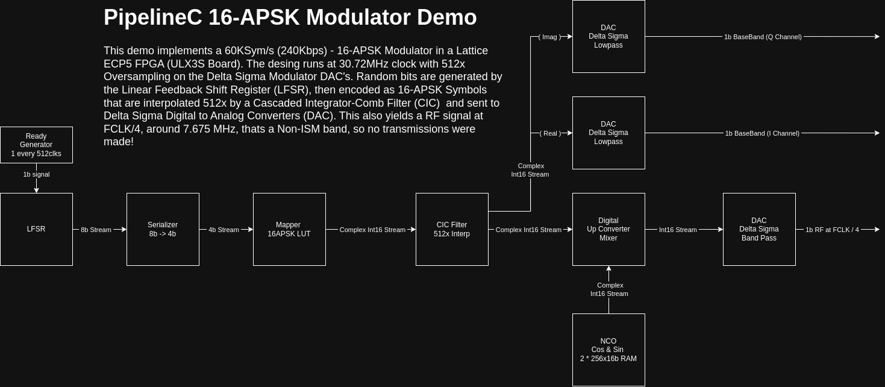
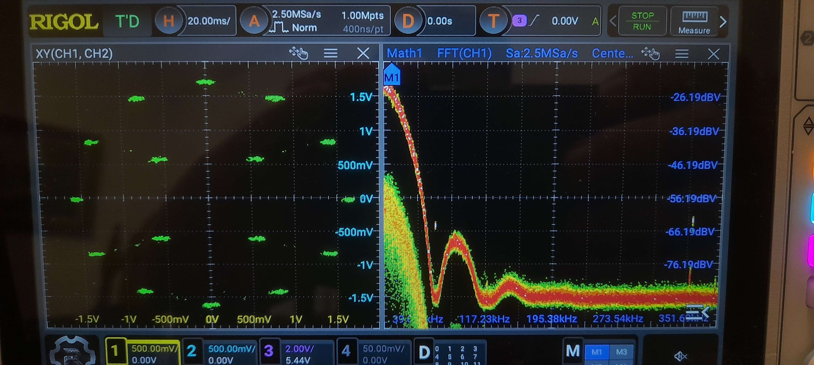
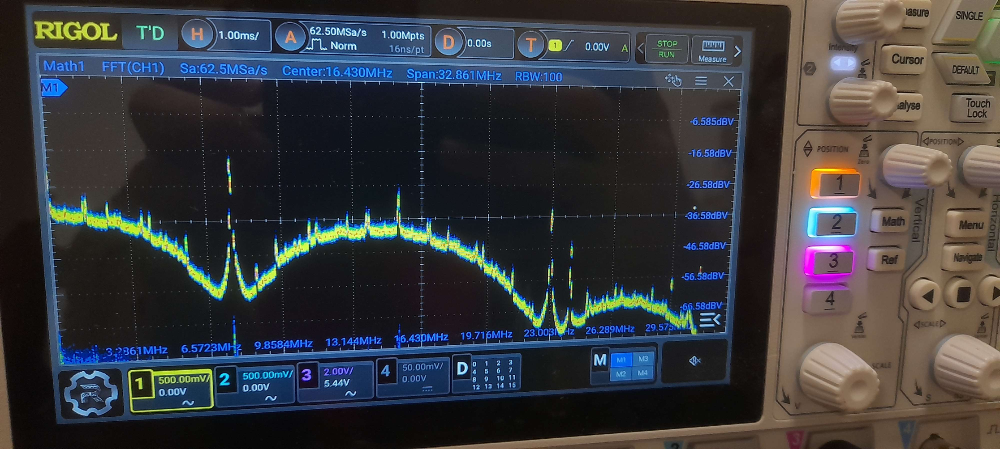

# APSK Modulator on FPGA

> [!WARNING]
>
> This code was tested on an earlier version of PipelineC within a configured environment, in case of issues feel free to ask for help.

This is a 16-APSK (and, 32-APSK, as a bonus) digital modulator implemented using the [PipelineC](https://github.com/JulianKemmerer/PipelineC) high-level synthesis HDL, running on a Lattice ECP5 (ULX3S) FPGA.

The modulator generates a baseband or RF-shifted signal using a chain of modular components:
- Pseudo-random data generation (LFSR)
- APSK symbol mapping
- CIC interpolation
- Digital upconversion (DUC)
- Delta-Sigma DACs (Low-pass & Band-pass)

📖🔗 **[Read the full article on LinkedIn →](https://www.linkedin.com/pulse/16-apsk-modulator-fpga-using-pipelinec-hdl-paulo-dutra-79uce)**

---

## 🔧 Block Diagram

*PipelineC 16-APSK Modulator Block Diagram and Some explanation about the design*

---

## ⚙️ FPGA Output

### Constellation Output (Baseband)

*Actual Constellation diagram and Spectrum generated by the FPGA Design using an external RC low-pass filter, visualized on a Rigol DHO804 Oscilloscope*

---

### RF Output Spectrum (~7.68 MHz)

*Band-Pass Delta Sigma Modulator output spectrum visualized using the FFT of the Rigol DHO804 Oscilloscope.*
---

## 🔬 Tools & Tech

- **HDL**: [PipelineC](https://github.com/JulianKemmerer/PipelineC) (C-based HLS HDL) + [OSS CAD Suite](https://github.com/YosysHQ/oss-cad-suite-build)
- **Simulation**: [CocoTB](https://www.cocotb.org/) + [GHDL](https://ghdl.github.io/ghdl/)
- **Board**: [ULX3S](https://ulx3s.github.io) (Lattice ECP5-85F)
- **Testbench**: Python, Matplotlib, GTKWave
- **Output**: Delta-Sigma DACs (2nd Order LP & Band-Pass)

---

## 📎 License

MIT © Paulo Dutra – PU4THZ

---

## 📌 TODO
- [ ] Test if this still works (many changes on the repo...)
- [ ] Improve documentation (diagrams, usage, examples)

📫 Feedback and collaboration are welcome!  